```mermaid
graph LR
    Client["Client"]
    Presentation_Layer["Presentation Layer"]
    Cross_Cutting_Concerns["Cross-Cutting Concerns"]
    Business_Logic_Layer["Business Logic Layer"]
    Data_Access_Layer["Data Access Layer"]
    Domain_Model["Domain Model"]
    Configuration_Management["Configuration Management"]
    Database_MySQL_["Database (MySQL)"]
    Client -- "sends request to" --> Cross_Cutting_Concerns
    Cross_Cutting_Concerns -- "forwards to" --> Presentation_Layer
    Presentation_Layer -- "invokes" --> Business_Logic_Layer
    Presentation_Layer -- "renders response for" --> Client
    Business_Logic_Layer -- "utilizes" --> Data_Access_Layer
    Business_Logic_Layer -- "operates on" --> Domain_Model
    Data_Access_Layer -- "interacts with" --> Database_MySQL_
    Data_Access_Layer -- "maps data to/from" --> Domain_Model
    Configuration_Management -- "configures" --> Presentation_Layer
    Configuration_Management -- "configures" --> Business_Logic_Layer
    Configuration_Management -- "configures" --> Data_Access_Layer
    click Presentation_Layer href "https://github.com/CodeBoarding/GeneratedOnBoardings/blob/main/ForestBlog/Presentation_Layer.md" "Details"
    click Cross_Cutting_Concerns href "https://github.com/CodeBoarding/GeneratedOnBoardings/blob/main/ForestBlog/Cross_Cutting_Concerns.md" "Details"
    click Business_Logic_Layer href "https://github.com/CodeBoarding/GeneratedOnBoardings/blob/main/ForestBlog/Business_Logic_Layer.md" "Details"
    click Data_Access_Layer href "https://github.com/CodeBoarding/GeneratedOnBoardings/blob/main/ForestBlog/Data_Access_Layer.md" "Details"
    click Domain_Model href "https://github.com/CodeBoarding/GeneratedOnBoardings/blob/main/ForestBlog/Domain_Model.md" "Details"
    click Configuration_Management href "https://github.com/CodeBoarding/GeneratedOnBoardings/blob/main/ForestBlog/Configuration_Management.md" "Details"
    click Database_MySQL_ href "https://github.com/CodeBoarding/GeneratedOnBoardings/blob/main/ForestBlog/Database_MySQL_.md" "Details"
```

## Details

One paragraph explaining the functionality which is represented by this graph. What the main flow is and what is its purpose.

### Client
The external user or system interacting with the application.

**Related Classes/Methods**: _None_

### Presentation Layer [[Expand]](./Presentation_Layer.md)
Handles HTTP requests, manages user input, orchestrates application flow, and renders responses. Main Responsibility: User interaction and UI rendering.

**Related Classes/Methods**: _None_

### Cross-Cutting Concerns [[Expand]](./Cross_Cutting_Concerns.md)
Implements functionalities that intercept requests across multiple layers, such as security and logging. Main Responsibility: Applying global policies and pre/post-processing.

**Related Classes/Methods**: _None_

### Business Logic Layer [[Expand]](./Business_Logic_Layer.md)
Encapsulates the core business rules, performs validations, and coordinates operations. Main Responsibility: Implementing application-specific business logic.

**Related Classes/Methods**: _None_

### Data Access Layer [[Expand]](./Data_Access_Layer.md)
Provides an abstract interface for interacting with the database, handling data persistence and retrieval. Main Responsibility: Data persistence and mapping.

**Related Classes/Methods**: _None_

### Domain Model [[Expand]](./Domain_Model.md)
Represents the core business objects, data structures (entities, DTOs), and enumerations used throughout the application. Main Responsibility: Data representation and encapsulation.

**Related Classes/Methods**: _None_

### Configuration Management [[Expand]](./Configuration_Management.md)
Manages application-wide settings, framework configurations, and externalized properties. Main Responsibility: Centralized application setup and environment adaptation.

**Related Classes/Methods**: _None_

### Database (MySQL) [[Expand]](./Database_MySQL_.md)
The persistent storage system for application data. Main Responsibility: Data storage and retrieval.

**Related Classes/Methods**: _None_

### [FAQ](https://github.com/CodeBoarding/GeneratedOnBoardings/tree/main?tab=readme-ov-file#faq)