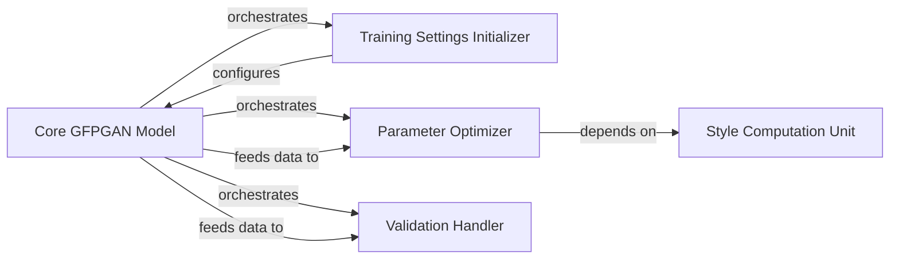

## Details

The `Core GFPGAN Model` subsystem is central to the GFPGAN framework, primarily encapsulated by the `GFPGANModel` class. This subsystem adheres to ML Toolkit/Library patterns by modularizing key functionalities related to model training, optimization, and validation.

### Core GFPGAN Model [[Expand]](./Core_GFPGAN_Model.md)
The central orchestrator of the GFPGAN framework, encapsulating generative/discriminative networks, managing forward/backward passes, loss computations, and overall model state. It serves as the main entry point for training and inference operations.

**Related Classes/Methods**:

- <a href="https://github.com/TencentARC/GFPGAN/blob/master/gfpgan/models/gfpgan_model.py#L17-L579" target="_blank" rel="noopener noreferrer">`gfpgan.models.gfpgan_model.GFPGANModel`:17-579</a>

### Training Settings Initializer
Configures the training environment, including setting up optimizers and potentially schedulers, ensuring the model is prepared for the training loop. This component adheres to "Modular Design" and "Clear Separation of Concerns" by isolating setup logic.

**Related Classes/Methods**:

- <a href="https://github.com/TencentARC/GFPGAN/blob/master/gfpgan/models/gfpgan_model.py#L17-L579" target="_blank" rel="noopener noreferrer">`gfpgan.models.gfpgan_model.GFPGANModel:init_training_settings`:17-579</a>
- <a href="https://github.com/TencentARC/GFPGAN/blob/master/gfpgan/models/gfpgan_model.py#L17-L579" target="_blank" rel="noopener noreferrer">`gfpgan.models.gfpgan_model.GFPGANModel:setup_optimizers`:17-579</a>

### Parameter Optimizer
Encapsulates the core optimization logic during the training phase. This involves managing forward and backward passes, computing various losses (e.g., GAN, pixel, perceptual, identity, style), and updating model parameters. This is central to "Data Flow and Transformation" and "Pipeline/Workflow" patterns.

**Related Classes/Methods**:

- <a href="https://github.com/TencentARC/GFPGAN/blob/master/gfpgan/models/gfpgan_model.py#L17-L579" target="_blank" rel="noopener noreferrer">`gfpgan.models.gfpgan_model.GFPGANModel:optimize_parameters`:17-579</a>
- <a href="https://github.com/TencentARC/GFPGAN/blob/master/gfpgan/models/gfpgan_model.py#L17-L579" target="_blank" rel="noopener noreferrer">`gfpgan.models.gfpgan_model.GFPGANModel:gray_resize_for_identity`:17-579</a>
- <a href="https://github.com/TencentARC/GFPGAN/blob/master/gfpgan/models/gfpgan_model.py#L17-L579" target="_blank" rel="noopener noreferrer">`gfpgan.models.gfpgan_model.GFPGANModel:construct_img_pyramid`:17-579</a>

### Validation Handler
Manages the model validation process, handling both distributed and non-distributed scenarios. It is responsible for evaluating model performance, logging metrics, and potentially saving validation results. This aligns with "Modular Design" and "Clear Separation of Concerns" by separating validation logic from core training.

**Related Classes/Methods**:

- <a href="https://github.com/TencentARC/GFPGAN/blob/master/gfpgan/models/gfpgan_model.py#L17-L579" target="_blank" rel="noopener noreferrer">`gfpgan.models.gfpgan_model.GFPGANModel:dist_validation`:17-579</a>
- <a href="https://github.com/TencentARC/GFPGAN/blob/master/gfpgan/models/gfpgan_model.py#L17-L579" target="_blank" rel="noopener noreferrer">`gfpgan.models.gfpgan_model.GFPGANModel:nondist_validation`:17-579</a>
- <a href="https://github.com/TencentARC/GFPGAN/blob/master/gfpgan/models/gfpgan_model.py#L17-L579" target="_blank" rel="noopener noreferrer">`gfpgan.models.gfpgan_model.GFPGANModel:test`:17-579</a>
- <a href="https://github.com/TencentARC/GFPGAN/blob/master/gfpgan/models/gfpgan_model.py#L17-L579" target="_blank" rel="noopener noreferrer">`gfpgan.models.gfpgan_model.GFPGANModel:_log_validation_metric_values`:17-579</a>

### Style Computation Unit
A specialized utility component within the model responsible for computing style-related metrics, specifically through the calculation of the Gram matrix. This supports perceptual and style losses used in the optimization process. This aligns with "Utility/Helper Functions" and "Modular Design" patterns.

**Related Classes/Methods**:

- <a href="https://github.com/TencentARC/GFPGAN/blob/master/gfpgan/models/gfpgan_model.py#L17-L579" target="_blank" rel="noopener noreferrer">`gfpgan.models.gfpgan_model.GFPGANModel:_comp_style`:17-579</a>
- <a href="https://github.com/TencentARC/GFPGAN/blob/master/gfpgan/models/gfpgan_model.py#L17-L579" target="_blank" rel="noopener noreferrer">`gfpgan.models.gfpgan_model.GFPGANModel:_gram_mat`:17-579</a>

### [FAQ](https://github.com/CodeBoarding/GeneratedOnBoardings/tree/main?tab=readme-ov-file#faq)