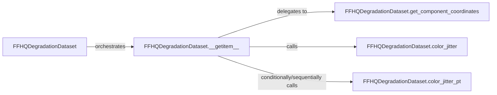

## Details

The `Data Handling & Preprocessing` subsystem is responsible for managing the entire lifecycle of image data within the GFPGAN project. This includes loading raw images, applying various degradations and augmentations, extracting regions of interest (ROIs), and transforming the data into a tensor format suitable for model input. Its scope is limited to preparing data for the training and inference pipelines, acting as an interface between raw data sources and the model.

### FFHQDegradationDataset
This is the primary data handler for the FFHQ dataset. It encapsulates the logic for loading images, applying various degradations (e.g., resizing, noise, blur), and orchestrating the overall data preparation process. It acts as the main interface for the data pipeline.

**Related Classes/Methods**:

- <a href="https://github.com/TencentARC/GFPGAN/blob/master/gfpgan/data/ffhq_degradation_dataset.py#L16-L230" target="_blank" rel="noopener noreferrer">`FFHQDegradationDataset`:16-230</a>

### FFHQDegradationDataset.__getitem__
This method defines the core data processing pipeline for a single image sample. It orchestrates the sequence of operations, including loading, degradation, ROI extraction, and augmentation, ensuring the data is correctly prepared as a tensor for model consumption.

**Related Classes/Methods**:

- <a href="https://github.com/TencentARC/GFPGAN/blob/master/gfpgan/data/ffhq_degradation_dataset.py" target="_blank" rel="noopener noreferrer">`FFHQDegradationDataset.__getitem__`</a>

### FFHQDegradationDataset.get_component_coordinates
Responsible for identifying and extracting specific regions of interest (ROIs), such as facial landmarks or bounding boxes, within an image. This is crucial for tasks like face detection and alignment, ensuring the model focuses on relevant areas.

**Related Classes/Methods**:

- <a href="https://github.com/TencentARC/GFPGAN/blob/master/gfpgan/data/ffhq_degradation_dataset.py" target="_blank" rel="noopener noreferrer">`FFHQDegradationDataset.get_component_coordinates`</a>

### FFHQDegradationDataset.color_jitter
Applies various color-based augmentations (e.g., brightness, contrast, saturation, hue adjustments) to the image. This enhances the diversity of the training dataset, improving the model's robustness to variations in image appearance.

**Related Classes/Methods**:

- <a href="https://github.com/TencentARC/GFPGAN/blob/master/gfpgan/data/ffhq_degradation_dataset.py" target="_blank" rel="noopener noreferrer">`FFHQDegradationDataset.color_jitter`</a>

### FFHQDegradationDataset.color_jitter_pt
Performs similar color jittering operations to `color_jitter`, potentially leveraging PyTorch's native functionalities or specific augmentation libraries for efficiency or advanced techniques. It contributes to the overall data augmentation strategy.

**Related Classes/Methods**:

- <a href="https://github.com/TencentARC/GFPGAN/blob/master/gfpgan/data/ffhq_degradation_dataset.py" target="_blank" rel="noopener noreferrer">`FFHQDegradationDataset.color_jitter_pt`</a>

### [FAQ](https://github.com/CodeBoarding/GeneratedOnBoardings/tree/main?tab=readme-ov-file#faq)