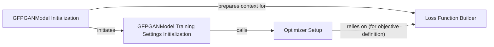

## Details

This subsystem is responsible for defining the objective functions (losses) that guide the training of the GFPGAN model and for configuring the optimization algorithms used to update the model's parameters. It is critical for minimizing the difference between generated and real images and ensuring effective model learning.

### Loss Function Builder
This component is responsible for instantiating and configuring the various loss functions (e.g., pixel, perceptual, GAN, identity losses) that define the model's training objectives. It dynamically constructs the loss modules based on the project's configuration.

**Related Classes/Methods**:

- <a href="https://github.com/TencentARC/GFPGAN/blob/master/gfpgan/models/gfpgan_model.py" target="_blank" rel="noopener noreferrer">`GFPGANModel.build_loss`</a>

### Optimizer Setup
This component initializes and configures the optimization algorithms (e.g., Adam) that are used to update the model's parameters during the training process. It ensures that the model's weights are adjusted effectively to minimize the defined loss.

**Related Classes/Methods**:

- <a href="https://github.com/TencentARC/GFPGAN/blob/master/gfpgan/models/gfpgan_model.py" target="_blank" rel="noopener noreferrer">`GFPGANModel.setup_optimizers`</a>

### GFPGANModel Initialization
The constructor of the GFPGANModel, responsible for overall model setup.

**Related Classes/Methods**:

- <a href="https://github.com/TencentARC/GFPGAN/blob/master/gfpgan/models/gfpgan_model.py" target="_blank" rel="noopener noreferrer">`GFPGANModel.__init__`</a>

### GFPGANModel Training Settings Initialization
Method within GFPGANModel that orchestrates overall training setup.

**Related Classes/Methods**:

- <a href="https://github.com/TencentARC/GFPGAN/blob/master/gfpgan/models/gfpgan_model.py" target="_blank" rel="noopener noreferrer">`GFPGANModel.init_training_settings`</a>

### [FAQ](https://github.com/CodeBoarding/GeneratedOnBoardings/tree/main?tab=readme-ov-file#faq)