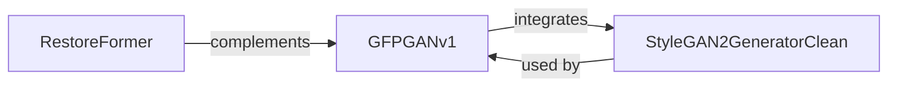

## Details

The GFPGAN architecture is centered around the `GFPGANv1` component, which orchestrates a comprehensive face restoration pipeline. This pipeline heavily relies on the `StyleGAN2GeneratorClean` for its robust style-based image synthesis capabilities, where components like `ModulatedConv2d` and `ToRGB` are fundamental for generating and rendering high-quality images. Complementing this GAN-based approach, the `RestoreFormer` component provides a distinct transformer-based pathway for general image restoration, utilizing `MultiHeadEncoder` and `MultiHeadDecoderTransformer` for efficient feature processing and resolution management via `Downsample` and `Upsample` operations. This dual-component strategy allows GFPGAN to address a wide range of image restoration challenges effectively.

### GFPGANv1
Implements the end-to-end GFPGANv1 generator, specifically tailored for high-fidelity face restoration. It orchestrates multiple sub-components to form a comprehensive generative pipeline, integrating both StyleGAN2 principles and residual learning. This component is central as it represents the primary face restoration model.

**Related Classes/Methods**:

- <a href="https://github.com/TencentARC/GFPGAN/blob/master/gfpgan/archs/stylegan2_clean_arch.py#L194-L368" target="_blank" rel="noopener noreferrer">`StyleGAN2GeneratorClean`:194-368</a>
- <a href="https://github.com/TencentARC/GFPGAN/blob/master/gfpgan/archs/gfpganv1_arch.py#L132-L194" target="_blank" rel="noopener noreferrer">`ConvUpLayer`:132-194</a>
- <a href="https://github.com/TencentARC/GFPGAN/blob/master/gfpgan/archs/gfpganv1_arch.py#L12-L129" target="_blank" rel="noopener noreferrer">`StyleGAN2GeneratorSFT`:12-129</a>
- <a href="https://github.com/TencentARC/GFPGAN/blob/master/gfpgan/archs/gfpganv1_arch.py#L197-L217" target="_blank" rel="noopener noreferrer">`ResUpBlock`:197-217</a>

### StyleGAN2GeneratorClean
Provides a clean and modular implementation of the StyleGAN2 generator. Its core function is style-based image synthesis through modulated convolutions, serving as a fundamental generative building block that can be used independently or as part of larger architectures. It is a foundational generative model.

**Related Classes/Methods**:

- <a href="https://github.com/TencentARC/GFPGAN/blob/master/gfpgan/archs/stylegan2_clean_arch.py#L24-L103" target="_blank" rel="noopener noreferrer">`ModulatedConv2d`:24-103</a>
- <a href="https://github.com/TencentARC/GFPGAN/blob/master/gfpgan/archs/stylegan2_clean_arch.py#L177-L191" target="_blank" rel="noopener noreferrer">`ConstantInput`:177-191</a>
- <a href="https://github.com/TencentARC/GFPGAN/blob/master/gfpgan/archs/stylegan2_clean_arch.py#L106-L138" target="_blank" rel="noopener noreferrer">`StyleConv`:106-138</a>
- <a href="https://github.com/TencentARC/GFPGAN/blob/master/gfpgan/archs/stylegan2_clean_arch.py#L10-L21" target="_blank" rel="noopener noreferrer">`NormStyleCode`:10-21</a>
- <a href="https://github.com/TencentARC/GFPGAN/blob/master/gfpgan/archs/gfpganv1_clean_arch.py" target="_blank" rel="noopener noreferrer">`ToRGB`</a>

### RestoreFormer
Defines a transformer-based architecture specifically designed for general image restoration tasks. It leverages attention mechanisms to effectively process and restore image features, offering an alternative or complementary approach to GAN-based restoration. This component represents a distinct, non-GAN-based restoration approach.

**Related Classes/Methods**:

- <a href="https://github.com/TencentARC/GFPGAN/blob/master/gfpgan/archs/restoreformer_arch.py#L258-L359" target="_blank" rel="noopener noreferrer">`MultiHeadEncoder`:258-359</a>
- <a href="https://github.com/TencentARC/GFPGAN/blob/master/gfpgan/archs/restoreformer_arch.py#L467-L570" target="_blank" rel="noopener noreferrer">`MultiHeadDecoderTransformer`:467-570</a>
- <a href="https://github.com/TencentARC/GFPGAN/blob/master/gfpgan/archs/restoreformer_arch.py#L9-L105" target="_blank" rel="noopener noreferrer">`VectorQuantizer`:9-105</a>
- <a href="https://github.com/TencentARC/GFPGAN/blob/master/gfpgan/archs/arcface_arch.py" target="_blank" rel="noopener noreferrer">`Downsample`</a>
- <a href="https://github.com/TencentARC/GFPGAN/blob/master/gfpgan/archs/stylegan2_clean_arch.py" target="_blank" rel="noopener noreferrer">`Upsample`</a>
- <a href="https://github.com/TencentARC/GFPGAN/blob/master/gfpgan/archs/restoreformer_arch.py#L114-L115" target="_blank" rel="noopener noreferrer">`Normalize`:114-115</a>
- <a href="https://github.com/TencentARC/GFPGAN/blob/master/gfpgan/archs/restoreformer_arch.py#L197-L255" target="_blank" rel="noopener noreferrer">`MultiHeadAttnBlock`:197-255</a>
- <a href="https://github.com/TencentARC/GFPGAN/blob/master/gfpgan/archs/restoreformer_arch.py#L152-L194" target="_blank" rel="noopener noreferrer">`ResnetBlock`:152-194</a>

### [FAQ](https://github.com/CodeBoarding/GeneratedOnBoardings/tree/main?tab=readme-ov-file#faq)