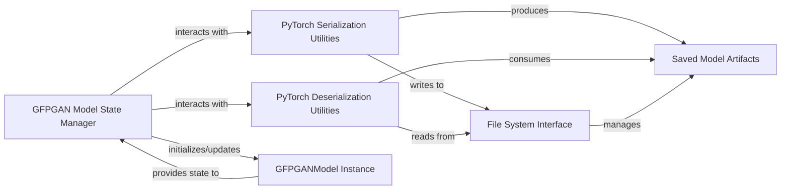

## Details

One paragraph explaining the functionality which is represented by this graph. What the main flow is and what is its purpose.

### GFPGAN Model State Manager
This component encapsulates the specific logic for saving and loading the `GFPGANModel`'s internal state, including model weights, optimizer states, and other relevant training metadata. It acts as the primary interface for the persistence operations from the model's perspective.

**Related Classes/Methods**:

- <a href="https://github.com/TencentARC/GFPGAN/blob/master/gfpgan/models/gfpgan_model.py" target="_blank" rel="noopener noreferrer">`gfpgan.models.gfpgan_model.GFPGANModel.save`</a>
- <a href="https://github.com/TencentARC/GFPGAN/blob/master/gfpgan/models/gfpgan_model.py" target="_blank" rel="noopener noreferrer">`gfpgan.models.gfpgan_model.GFPGANModel.load_network`</a>

### PyTorch Serialization Utilities
Provides the fundamental mechanisms for converting PyTorch tensors and model states into a byte stream suitable for storage. This component is a direct dependency for saving any PyTorch-based model.

**Related Classes/Methods**:

- <a href="https://github.com/TencentARC/GFPGAN/blob/master/" target="_blank" rel="noopener noreferrer">`torch.save`</a>

### PyTorch Deserialization Utilities
Provides the fundamental mechanisms for reconstructing PyTorch tensors and model states from a byte stream. This component is a direct dependency for loading any PyTorch-based model.

**Related Classes/Methods**:

- <a href="https://github.com/TencentARC/GFPGAN/blob/master/" target="_blank" rel="noopener noreferrer">`torch.load`</a>

### File System Interface
Represents the abstraction over the underlying storage medium (e.g., disk). It handles the physical reading from and writing to files, providing the persistence layer for the serialized model data.

**Related Classes/Methods**:

### GFPGANModel Instance
The actual instance of the GFPGAN model whose state is being persisted or restored. It is the subject of the save/load operations.

**Related Classes/Methods**:

- <a href="https://github.com/TencentARC/GFPGAN/blob/master/gfpgan/models/gfpgan_model.py#L17-L579" target="_blank" rel="noopener noreferrer">`gfpgan.models.gfpgan_model.GFPGANModel`:17-579</a>

### Saved Model Artifacts
These are the persistent files on the storage medium that contain the serialized state of the GFPGAN models. They serve as the tangible output of the saving process and the input for the loading process.

**Related Classes/Methods**: _None_

### [FAQ](https://github.com/CodeBoarding/GeneratedOnBoardings/tree/main?tab=readme-ov-file#faq)