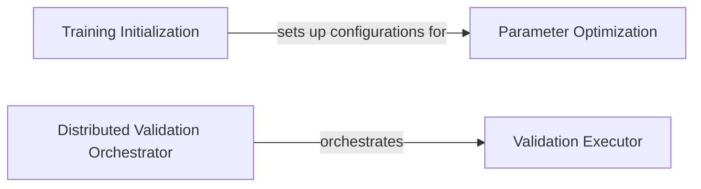

## Details

The `GFPGANModel` subsystem orchestrates the core training and validation lifecycle of the GFPGAN model. It begins with the `Training Initialization` component, which sets up the necessary configurations for the training environment. Following initialization, the `Parameter Optimization` component iteratively refines the model's parameters through forward and backward passes. Concurrently, or at designated intervals, validation is performed. In a distributed setup, the `Distributed Validation Orchestrator` coordinates validation tasks across multiple nodes, delegating the actual evaluation to the `Validation Executor`. The `Validation Executor` is responsible for executing the core validation steps, including inference, metric calculation, and logging, handling both distributed and non-distributed validation scenarios.

### Training Initialization
This component is responsible for setting up the training environment, including the configuration of optimizers, learning rate schedulers, and other training-specific parameters. It prepares the model for the training loop.

**Related Classes/Methods**:

- <a href="https://github.com/TencentARC/GFPGAN/blob/master/gfpgan/models/gfpgan_model.py" target="_blank" rel="noopener noreferrer">`gfpgan.models.gfpgan_model.GFPGANModel.init_training_settings`</a>
- <a href="https://github.com/TencentARC/GFPGAN/blob/master/gfpgan/models/gfpgan_model.py" target="_blank" rel="noopener noreferrer">`gfpgan.models.gfpgan_model.GFPGANModel.setup_optimizers`</a>

### Parameter Optimization
This component executes a single training iteration. It encompasses the forward pass of data through the model, calculation of loss functions, and subsequent backpropagation to update model parameters based on the computed gradients.

**Related Classes/Methods**:

- <a href="https://github.com/TencentARC/GFPGAN/blob/master/gfpgan/models/gfpgan_model.py" target="_blank" rel="noopener noreferrer">`gfpgan.models.gfpgan_model.GFPGANModel.optimize_parameters`</a>

### Distributed Validation Orchestrator
This component manages the validation process specifically within a distributed training setup. It coordinates the validation tasks across multiple processing units or nodes to ensure efficient and synchronized evaluation.

**Related Classes/Methods**:

- <a href="https://github.com/TencentARC/GFPGAN/blob/master/gfpgan/models/gfpgan_model.py" target="_blank" rel="noopener noreferrer">`gfpgan.models.gfpgan_model.GFPGANModel.dist_validation`</a>

### Validation Executor
This component performs the core validation steps. It involves running inference on the validation dataset, calculating various performance metrics (e.g., PSNR, SSIM, FID), and preparing these metrics for logging and reporting.

**Related Classes/Methods**:

- <a href="https://github.com/TencentARC/GFPGAN/blob/master/gfpgan/models/gfpgan_model.py" target="_blank" rel="noopener noreferrer">`gfpgan.models.gfpgan_model.GFPGANModel.nondist_validation`</a>
- <a href="https://github.com/TencentARC/GFPGAN/blob/master/gfpgan/models/gfpgan_model.py" target="_blank" rel="noopener noreferrer">`gfpgan.models.gfpgan_model.GFPGANModel.test`</a>
- <a href="https://github.com/TencentARC/GFPGAN/blob/master/gfpgan/models/gfpgan_model.py" target="_blank" rel="noopener noreferrer">`gfpgan.models.gfpgan_model.GFPGANModel._log_validation_metric_values`</a>

### [FAQ](https://github.com/CodeBoarding/GeneratedOnBoardings/tree/main?tab=readme-ov-file#faq)