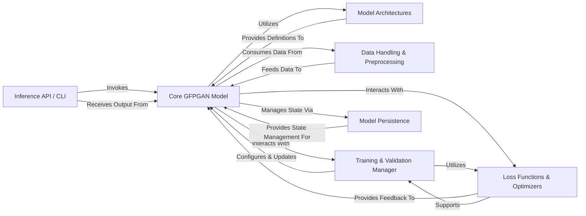

## Details

The GFPGAN architecture is centered around the `Core GFPGAN Model`, which acts as the primary processing unit for image restoration. User interaction is facilitated by the `Inference API / CLI`, which dispatches requests to and receives results from the core model. The `Core GFPGAN Model` dynamically integrates various `Model Architectures` to perform its generative and discriminative functions, while `Data Handling & Preprocessing` ensures a continuous supply of properly formatted input. During the training phase, the `Training & Validation Manager` orchestrates the learning process, leveraging `Loss Functions & Optimizers` to refine the model's parameters. `Model Persistence` is a critical support component, enabling the saving and loading of the `Core GFPGAN Model`'s state, which is essential for both development and deployment workflows. This clear component separation and defined interaction pathways are optimized for both documentation clarity and visual diagram generation, highlighting the flow of data and control within the system.

### Inference API / CLI
The primary external interface for users to interact with the GFPGAN model, handling input, orchestrating inference, and returning processed output.

**Related Classes/Methods**:

- <a href="https://github.com/TencentARC/GFPGAN/blob/master/cog_predict.py#L66-L149" target="_blank" rel="noopener noreferrer">`predict`:66-149</a>

### Core GFPGAN Model [[Expand]](./Core_GFPGAN_Model.md)
The central orchestrator of the GFPGAN framework, encapsulating generative/discriminative networks, managing forward/backward passes, loss computations, and overall model state.

**Related Classes/Methods**:

- <a href="https://github.com/TencentARC/GFPGAN/blob/master/gfpgan/models/gfpgan_model.py#L17-L579" target="_blank" rel="noopener noreferrer">`GFPGANModel`:17-579</a>

### Model Architectures [[Expand]](./Model_Architectures.md)
Defines the various neural network structures (e.g., GFPGANv1, StyleGAN2, RestoreFormer) that constitute the generative and discriminative components of the GFPGAN model.

**Related Classes/Methods**:

- <a href="https://github.com/TencentARC/GFPGAN/blob/master/gfpgan/archs/gfpganv1_arch.py#L220-L401" target="_blank" rel="noopener noreferrer">`GFPGANv1`:220-401</a>
- <a href="https://github.com/TencentARC/GFPGAN/blob/master/gfpgan/archs/stylegan2_clean_arch.py#L194-L368" target="_blank" rel="noopener noreferrer">`StyleGAN2GeneratorClean`:194-368</a>
- <a href="https://github.com/TencentARC/GFPGAN/blob/master/gfpgan/archs/restoreformer_arch.py#L573-L658" target="_blank" rel="noopener noreferrer">`RestoreFormer`:573-658</a>

### Data Handling & Preprocessing [[Expand]](./Data_Handling_Preprocessing.md)
Manages the entire lifecycle of image data, from loading raw images to preparing them as tensors suitable for model input, including augmentation and ROI extraction.

**Related Classes/Methods**:

- <a href="https://github.com/TencentARC/GFPGAN/blob/master/gfpgan/data/ffhq_degradation_dataset.py#L16-L230" target="_blank" rel="noopener noreferrer">`FFHQDegradationDataset`:16-230</a>

### Training & Validation Manager [[Expand]](./Training_Validation_Manager.md)
Oversees the entire training and evaluation process, including initializing optimizers, applying loss functions, managing iterations, and performing parameter updates and performance evaluation.

**Related Classes/Methods**:

- <a href="https://github.com/TencentARC/GFPGAN/blob/master/gfpgan/models/gfpgan_model.py" target="_blank" rel="noopener noreferrer">`GFPGANModel.init_training_settings`</a>
- <a href="https://github.com/TencentARC/GFPGAN/blob/master/gfpgan/models/gfpgan_model.py" target="_blank" rel="noopener noreferrer">`GFPGANModel.optimize_parameters`</a>
- <a href="https://github.com/TencentARC/GFPGAN/blob/master/gfpgan/models/gfpgan_model.py" target="_blank" rel="noopener noreferrer">`GFPGANModel.dist_validation`</a>
- <a href="https://github.com/TencentARC/GFPGAN/blob/master/gfpgan/models/gfpgan_model.py" target="_blank" rel="noopener noreferrer">`GFPGANModel.nondist_validation`</a>

### Loss Functions & Optimizers [[Expand]](./Loss_Functions_Optimizers.md)
A collection of various loss functions (e.g., pixel, perceptual, GAN, identity) and optimization algorithms critical for guiding the training process and minimizing the difference between generated and real images.

**Related Classes/Methods**:

- <a href="https://github.com/TencentARC/GFPGAN/blob/master/gfpgan/models/gfpgan_model.py" target="_blank" rel="noopener noreferrer">`GFPGANModel.build_loss`</a>
- <a href="https://github.com/TencentARC/GFPGAN/blob/master/gfpgan/models/gfpgan_model.py" target="_blank" rel="noopener noreferrer">`GFPGANModel.setup_optimizers`</a>

### Model Persistence [[Expand]](./Model_Persistence.md)
Manages the saving and loading of model weights, optimizer states, and other training progress information, essential for resuming training or deploying models.

**Related Classes/Methods**:

- <a href="https://github.com/TencentARC/GFPGAN/blob/master/gfpgan/models/gfpgan_model.py" target="_blank" rel="noopener noreferrer">`GFPGANModel.save`</a>
- <a href="https://github.com/TencentARC/GFPGAN/blob/master/gfpgan/models/gfpgan_model.py" target="_blank" rel="noopener noreferrer">`load_network`</a>

### [FAQ](https://github.com/CodeBoarding/GeneratedOnBoardings/tree/main?tab=readme-ov-file#faq)