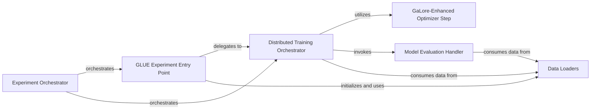

## Details

The GaLore project's training subsystem is orchestrated by the Experiment Orchestrator, which sets up and manages the entire training or benchmarking process. For GLUE benchmark tasks, the GLUE Experiment Entry Point serves as the initial interface, handling argument parsing and dataset loading before delegating the core training execution to the Distributed Training Orchestrator. This orchestrator drives the main training loop, managing epochs, batch processing, and coordinating evaluation. It leverages the GaLore-Enhanced Optimizer Step for memory-efficient optimization and periodically invokes the Model Evaluation Handler to assess performance. Both the Distributed Training Orchestrator and the Model Evaluation Handler rely on Data Loaders to provide the necessary training, validation, and evaluation data. This structured interaction ensures a clear flow from experiment setup to distributed training and model evaluation.

### Experiment Orchestrator [[Expand]](./Experiment_Orchestrator.md)
The top-level component responsible for setting up and managing the entire training or benchmarking process. It initializes models, data loaders, optimizers (including GaLore-enhanced ones), and orchestrates the training loop, epoch management, and evaluation. This component acts as the central control flow.

**Related Classes/Methods**:

- <a href="https://github.com/jiaweizzhao/GaLore/blob/master/run_glue.py" target="_blank" rel="noopener noreferrer">`run_glue.py`</a>
- <a href="https://github.com/jiaweizzhao/GaLore/blob/master/torchrun_main.py" target="_blank" rel="noopener noreferrer">`torchrun_main.py`</a>

### GLUE Experiment Entry Point
Serves as the primary entry point for running experiments specifically tailored for GLUE benchmark tasks. It handles initial argument parsing, loads task-specific datasets and models, and sets up the environment before delegating to the core training orchestrator.

**Related Classes/Methods**:

- <a href="https://github.com/jiaweizzhao/GaLore/blob/master/run_glue.py#L243-L753" target="_blank" rel="noopener noreferrer">`run_glue.main`:243-753</a>
- <a href="https://github.com/jiaweizzhao/GaLore/blob/master/run_glue.py#L72-L240" target="_blank" rel="noopener noreferrer">`run_glue.parse_args`:72-240</a>

### Distributed Training Orchestrator
Manages the core distributed training loop. This component is responsible for driving the training process, initializing models and optimizers (including GaLore-enhanced ones), handling epoch management, batch processing, and coordinating evaluation phases. It is the central execution engine for the training run.

**Related Classes/Methods**:

- <a href="https://github.com/jiaweizzhao/GaLore/blob/master/torchrun_main.py#L129-L565" target="_blank" rel="noopener noreferrer">`torchrun_main.main`:129-565</a>

### GaLore-Enhanced Optimizer Step
Represents the functionality related to instantiating and stepping the GaLore-enhanced optimizer within the training process, applying GaLore's memory-efficient optimization techniques.

**Related Classes/Methods**:

- <a href="https://github.com/jiaweizzhao/GaLore/blob/master/torchrun_main.py" target="_blank" rel="noopener noreferrer">`torchrun_main.py`</a>

### Model Evaluation Handler
Handles the assessment of model performance during training at predefined intervals, typically on a validation dataset. It computes metrics relevant to the task.

**Related Classes/Methods**:

- <a href="https://github.com/jiaweizzhao/GaLore/blob/master/torchrun_main.py" target="_blank" rel="noopener noreferrer">`torchrun_main.py`</a>

### Data Loaders
Responsible for fetching and preparing training and validation batches for the training and evaluation processes. This includes loading datasets, tokenization, and batching.

**Related Classes/Methods**:

- <a href="https://github.com/jiaweizzhao/GaLore/blob/master/run_glue.py" target="_blank" rel="noopener noreferrer">`run_glue.py`</a>
- <a href="https://github.com/jiaweizzhao/GaLore/blob/master/torchrun_main.py" target="_blank" rel="noopener noreferrer">`torchrun_main.py`</a>

### [FAQ](https://github.com/CodeBoarding/GeneratedOnBoardings/tree/main?tab=readme-ov-file#faq)