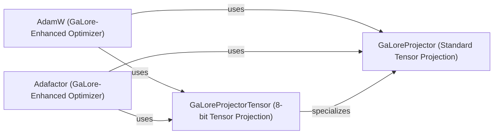

## Details

The `GaLore Optimization Core` subsystem is the central mechanism of the GaLore library, providing low-rank projection capabilities integrated directly into PyTorch optimizers. It acts as a plug-in to enhance existing deep learning training pipelines by optimizing gradient updates.

### AdamW (GaLore-Enhanced Optimizer)
This component provides an enhanced version of the standard PyTorch AdamW optimizer. It integrates GaLore's low-rank projection mechanism directly into its gradient update step, serving as a drop-in replacement for the original AdamW to enable memory-efficient training.

**Related Classes/Methods**:

- <a href="https://github.com/jiaweizzhao/GaLore/blob/master/galore_torch/adamw.py#L1-L9999" target="_blank" rel="noopener noreferrer">`galore_torch.adamw`:1-9999</a>

### Adafactor (GaLore-Enhanced Optimizer)
Similar to the AdamW component, this provides an optimized version of the Adafactor algorithm. It incorporates GaLore's low-rank projection to reduce memory footprint and potentially accelerate training for models that typically use Adafactor.

**Related Classes/Methods**:

- <a href="https://github.com/jiaweizzhao/GaLore/blob/master/galore_torch/adafactor.py#L1-L9999" target="_blank" rel="noopener noreferrer">`galore_torch.adafactor`:1-9999</a>

### GaLoreProjector (Standard Tensor Projection)
This component encapsulates the fundamental low-rank projection logic for standard (non-8-bit) tensors. It is responsible for computing and applying orthogonal matrices to project gradients into a lower-dimensional space, which is the core mechanism for memory reduction.

**Related Classes/Methods**:

- <a href="https://github.com/jiaweizzhao/GaLore/blob/master/galore_torch/galore_projector.py#L1-L9999" target="_blank" rel="noopener noreferrer">`galore_torch.galore_projector`:1-9999</a>

### GaLoreProjectorTensor (8-bit Tensor Projection)
This specialized component extends the `GaLoreProjector` to handle low-rank projection and de-projection specifically for 8-bit quantized tensors. It manages the unique transformations and considerations required when applying GaLore to quantized data, ensuring compatibility with memory-efficient training techniques.

**Related Classes/Methods**:

- <a href="https://github.com/jiaweizzhao/GaLore/blob/master/galore_torch/galore_projector_tensor.py#L1-L9999" target="_blank" rel="noopener noreferrer">`galore_torch.galore_projector_tensor`:1-9999</a>

### [FAQ](https://github.com/CodeBoarding/GeneratedOnBoardings/tree/main?tab=readme-ov-file#faq)