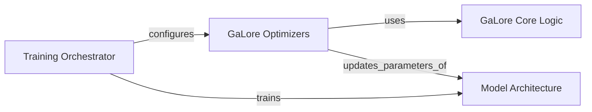

## Details

The GaLore subsystem is designed to enable memory-efficient training of large neural network models by integrating low-rank gradient projection into standard optimization algorithms. At its core, the `GaLore Core Logic` component provides the fundamental mathematical operations for projecting and de-projecting gradients. These operations are leveraged by `GaLore Optimizers`, which are specialized versions of common PyTorch optimizers. During the training process, the `Training Orchestrator` initializes a `Model Architecture` (e.g., a Llama model) and configures a `GaLore Optimizer` to train it. The `GaLore Optimizer` intercepts the gradients computed from the `Model Architecture`'s backward pass, applies the low-rank projection using the `GaLore Core Logic`, and then uses these projected gradients to update the model's parameters, thereby reducing memory footprint while maintaining training effectiveness.

### GaLore Optimizers
These are specialized PyTorch optimizers, such as `galore_torch.adamw.AdamW`, that extend standard optimization algorithms (e.g., AdamW) to incorporate GaLore's low-rank projection and memory optimization techniques. They manage parameter groups and their specific GaLore configurations (e.g., rank, update frequency) and are responsible for applying the projected gradients during the parameter update step.

**Related Classes/Methods**:

- <a href="https://github.com/jiaweizzhao/GaLore/blob/master/galore_torch/adamw.py#L16-L148" target="_blank" rel="noopener noreferrer">`galore_torch.adamw.AdamW`:16-148</a>

### GaLore Core Logic
This component, primarily embodied by `galore_torch.galore_projector.GaLoreProjector`, encapsulates the fundamental mathematical and algorithmic details of GaLore. It is responsible for performing low-rank projections of gradients (`project` method), managing accumulated low-rank updates, and reconstructing full-rank gradients (`project_back` method), forming the heart of GaLore's unique approach to memory-efficient training.

**Related Classes/Methods**:

- <a href="https://github.com/jiaweizzhao/GaLore/blob/master/galore_torch/galore_projector.py#L3-L102" target="_blank" rel="noopener noreferrer">`galore_torch.galore_projector.GaLoreProjector`:3-102</a>

### Model Architecture [[Expand]](./Model_Architecture.md)
This component represents the neural network model, such as `peft_pretraining.modeling_llama.LlamaForCausalLM`, that GaLore is applied to during training. It defines the model's layers, forward pass, and internal mechanisms (e.g., attention, embeddings). GaLore's optimizers interact with this component by receiving gradients computed from its forward and backward passes and applying updates to its parameters.

**Related Classes/Methods**:

- <a href="https://github.com/jiaweizzhao/GaLore/blob/master/peft_pretraining/modeling_llama.py#L603-L757" target="_blank" rel="noopener noreferrer">`peft_pretraining.modeling_llama.LlamaForCausalLM`:603-757</a>

### Training Orchestrator
This component represents the high-level scripts and utilities that set up and manage the training process. It is responsible for initializing the `Model Architecture`, configuring and instantiating `GaLore Optimizers` with the appropriate GaLore parameters, and driving the training loop, including data loading, forward/backward passes, and optimizer steps. This component implicitly handles the "integration" by correctly configuring the GaLore-enabled optimizers.

**Related Classes/Methods**: _None_

### [FAQ](https://github.com/CodeBoarding/GeneratedOnBoardings/tree/main?tab=readme-ov-file#faq)