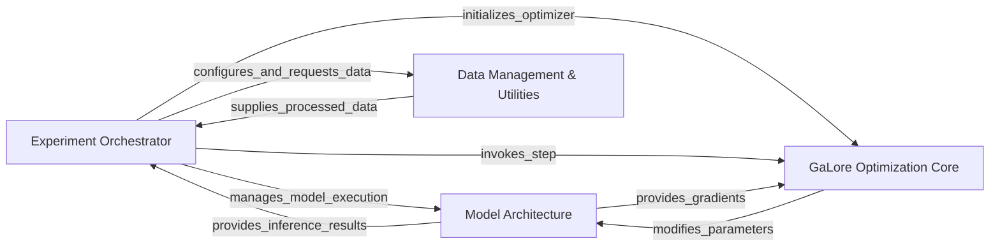

## Details

The Experiment Orchestrator serves as the central control unit, initiating and managing the entire training or benchmarking workflow. It configures_and_requests_data from the Data Management & Utilities component, which in turn supplies_processed_data batches back to the orchestrator. The Experiment Orchestrator also manages_model_execution within the Model Architecture component, feeding it input data and receiving inference_results in return. For optimization, the Experiment Orchestrator initializes_optimizer and invokes_step on the GaLore Optimization Core. During this process, the Model Architecture provides_gradients to the GaLore Optimization Core, which then modifies_parameters within the Model Architecture to facilitate efficient training. This setup ensures a clear, unidirectional flow for data and control, with distinct responsibilities for each component.

### Experiment Orchestrator [[Expand]](./Experiment_Orchestrator.md)
The top-level component responsible for setting up and managing the entire training or benchmarking process. It initializes models, data loaders, optimizers (including GaLore-enhanced ones), and orchestrates the training loop, epoch management, and evaluation. This component acts as the central control flow.

**Related Classes/Methods**:

- <a href="https://github.com/jiaweizzhao/GaLore/blob/master/peft_pretraining/args_utils.py#L7-L32" target="_blank" rel="noopener noreferrer">`torchrun_main`:7-32</a>
- <a href="https://github.com/jiaweizzhao/GaLore/blob/master/run_glue.py" target="_blank" rel="noopener noreferrer">`run_glue`</a>

### Model Architecture [[Expand]](./Model_Architecture.md)
Represents the neural network model being trained, specifically focusing on large language models like Llama. This component defines the model's layers, forward pass, and internal mechanisms (e.g., attention, embeddings). It receives input data and produces outputs (e.g., logits).

**Related Classes/Methods**:

- <a href="https://github.com/jiaweizzhao/GaLore/blob/master/peft_pretraining/modeling_llama.py" target="_blank" rel="noopener noreferrer">`peft_pretraining.modeling_llama`</a>

### GaLore Optimization Core [[Expand]](./GaLore_Optimization_Core.md)
This is the heart of the GaLore library, encapsulating the low-rank projection mechanism and its integration into PyTorch optimizers. It includes the core projection logic and the GaLore-enhanced versions of standard optimizers (e.g., AdamW, Adafactor). This component is designed to be a plug-in for existing training pipelines.

**Related Classes/Methods**:

- <a href="https://github.com/jiaweizzhao/GaLore/blob/master/galore_torch/adamw.py" target="_blank" rel="noopener noreferrer">`galore_torch.adamw`</a>
- <a href="https://github.com/jiaweizzhao/GaLore/blob/master/galore_torch/adafactor.py" target="_blank" rel="noopener noreferrer">`galore_torch.adafactor`</a>
- <a href="https://github.com/jiaweizzhao/GaLore/blob/master/galore_torch/galore_projector.py" target="_blank" rel="noopener noreferrer">`galore_torch.galore_projector`</a>
- <a href="https://github.com/jiaweizzhao/GaLore/blob/master/galore_torch/galore_projector_tensor.py" target="_blank" rel="noopener noreferrer">`galore_torch.galore_projector_tensor`</a>

### Data Management & Utilities [[Expand]](./Data_Management_Utilities.md)
Handles the loading, preprocessing, and batching of training and evaluation data. This component also includes general utilities necessary for the training process, such as learning rate schedulers, data collation functions, and other helper methods that support the training loop but are not part of the core model or optimizer logic.

**Related Classes/Methods**:

- <a href="https://github.com/jiaweizzhao/GaLore/blob/master/peft_pretraining/dataloader.py" target="_blank" rel="noopener noreferrer">`peft_pretraining.dataloader`</a>
- <a href="https://github.com/jiaweizzhao/GaLore/blob/master/peft_pretraining/training_utils.py" target="_blank" rel="noopener noreferrer">`peft_pretraining.training_utils`</a>

### [FAQ](https://github.com/CodeBoarding/GeneratedOnBoardings/tree/main?tab=readme-ov-file#faq)