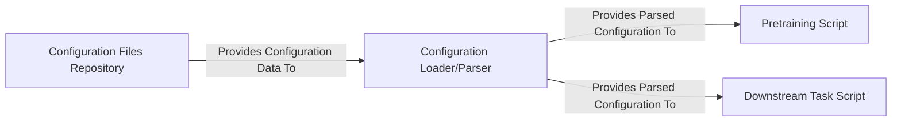

## Details

The Configuration System is a cornerstone of this Deep Learning Research Framework, providing a robust and flexible mechanism for managing all experimental parameters. It adheres to the "Configuration-Driven Development" architectural pattern, ensuring reproducibility, ease of experimentation, and clear separation of concerns.

### Configuration Files Repository
This component serves as the central, organized storage for all experimental parameters, model architectures, hyperparameters, dataset paths, and training settings. It is meticulously structured into `pretrain` and `downstream` subdirectories, with further categorization by specific tasks (e.g., EC, Fold3D, GO-BP) and model types. This hierarchical organization is crucial for managing the complexity of deep learning experiments, promoting reusability of configurations, and facilitating reproducible research by providing a single source of truth for all experimental setups.

**Related Classes/Methods**:

- `config/downstream/EC/BERT.yaml` (1:1)
- `config/pretrain/mc_gearnet_edge.yaml` (1:1)

### Configuration Loader/Parser
This component is responsible for programmatically reading, parsing, and transforming the raw YAML data from the `Configuration Files Repository` into structured, accessible objects. It likely leverages libraries such as `pyyaml` for parsing the YAML syntax and `easydict` to provide convenient dictionary-like access to the loaded configurations. This transformation is critical as it converts static configuration files into dynamic objects that can be easily consumed and manipulated by other parts of the system, such as training and evaluation scripts.

**Related Classes/Methods**:

- <a href="https://github.com/DeepGraphLearning/GearNet/blob/main/util.py#L1-L1" target="_blank" rel="noopener noreferrer">`util.py` (1:1)</a>

### Pretraining Script
This script orchestrates the pretraining phase of protein representation models. It is a primary consumer of the configurations, relying on the `Configuration Loader/Parser` to load specific settings related to model architecture, dataset paths, training schedules, optimization parameters, and other pretraining-specific configurations. This component embodies the "Training Loop Pattern" and uses the loaded configurations to initialize and execute the pretraining process.

**Related Classes/Methods**:

- <a href="https://github.com/DeepGraphLearning/GearNet/blob/main/script/pretrain.py#L1-L1" target="_blank" rel="noopener noreferrer">`script/pretrain.py` (1:1)</a>

### Downstream Task Script
This script manages the execution and evaluation of models on various downstream biological tasks (e.g., Enzyme Commission (EC) number prediction, 3D fold prediction, Gene Ontology (GO) term prediction). Similar to the pretraining script, it heavily relies on the `Configuration Loader/Parser` to load task-specific settings, including model configurations, dataset paths for the specific task, evaluation metrics, and fine-tuning parameters. This component also follows the "Training Loop Pattern" but is tailored for task-specific fine-tuning and evaluation.

**Related Classes/Methods**:

- <a href="https://github.com/DeepGraphLearning/GearNet/blob/main/script/downstream.py#L1-L1" target="_blank" rel="noopener noreferrer">`script/downstream.py` (1:1)</a>

### [FAQ](https://github.com/CodeBoarding/GeneratedOnBoardings/tree/main?tab=readme-ov-file#faq)