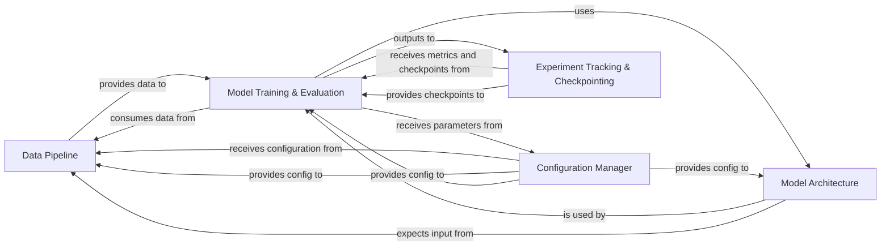

## Details

This project is a Deep Learning Research Framework/Library for Protein Representation Learning. The Data Pipeline component is central to its functionality, handling all aspects of data preparation for protein representation learning, from raw data acquisition to structured protein graphs and dataset splitting.

### Data Pipeline [[Expand]](./Data_Pipeline.md)
Manages the entire data lifecycle, including loading, preprocessing, featurization, and dataset splitting for protein data.

**Related Classes/Methods**:

- <a href="https://github.com/DeepGraphLearning/GearNet/blob/main/gearnet/dataset.py#L1-L1" target="_blank" rel="noopener noreferrer">`gearnet.dataset` (1:1)</a>

### Model Training & Evaluation
Orchestrates the training loops, model optimization, validation, and evaluation of protein representation models.

**Related Classes/Methods**:

- `scripts.train` (1:1)
- <a href="https://github.com/DeepGraphLearning/GearNet/blob/main/gearnet/model.py#L1-L1" target="_blank" rel="noopener noreferrer">`gearnet.model` (1:1)</a>

### Model Architecture
Defines the neural network architectures used for protein representation learning (e.g., graph neural networks).

**Related Classes/Methods**:

- <a href="https://github.com/DeepGraphLearning/GearNet/blob/main/gearnet/model.py#L1-L1" target="_blank" rel="noopener noreferrer">`gearnet.model` (1:1)</a>
- <a href="https://github.com/DeepGraphLearning/GearNet/blob/main/gearnet/layer.py#L1-L1" target="_blank" rel="noopener noreferrer">`gearnet.layer` (1:1)</a>

### Configuration Manager
Handles loading, parsing, and managing project configurations (e.g., model hyperparameters, dataset paths, training settings) from YAML files.

**Related Classes/Methods**:

- `utils.config` (1:1)

### Experiment Tracking & Checkpointing
Manages the logging of training metrics, saving model checkpoints, and potentially resuming training.

**Related Classes/Methods**:

- `utils.checkpoint` (1:1)
- `scripts.train` (1:1)

### [FAQ](https://github.com/CodeBoarding/GeneratedOnBoardings/tree/main?tab=readme-ov-file#faq)