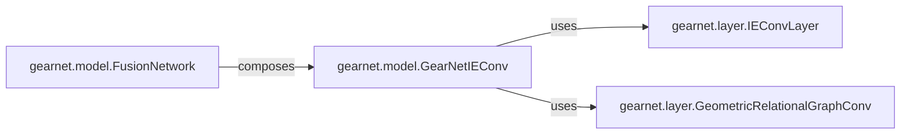

## Details

The `gearnet` subsystem is designed for molecular representation learning, primarily focusing on graph neural networks. It comprises distinct layers that perform specific graph operations and a model that orchestrates these layers to process molecular structures.

### gearnet.layer.IEConvLayer
This component represents an Interaction-Enhanced Convolutional Layer. It's a fundamental building block for processing graph-structured data, specifically designed to incorporate detailed interaction information between nodes (e.g., atoms in a molecule).

**Related Classes/Methods**: _None_

### gearnet.layer.GeometricRelationalGraphConv
This component implements a Geometric Relational Graph Convolutional layer. It's another core layer type within the GearNet architecture, focusing on incorporating both geometric and relational information during graph convolutions.

**Related Classes/Methods**: _None_

### gearnet.model.GearNetIEConv
This is the main GearNet model, specifically an Interaction-Enhanced Convolutional Graph Neural Network. It orchestrates multiple `GeometricRelationalGraphConv` layers and optionally `IEConvLayer` instances to build a deep graph neural network for molecular representation learning.

**Related Classes/Methods**: _None_

### gearnet.model.FusionNetwork
This component is a higher-level model designed to combine the outputs of two distinct models: a `sequence_model` and a `structure_model`. It's likely used for multi-modal learning, integrating information from different representations (e.g., sequence data and structural data of a molecule).

**Related Classes/Methods**: _None_

### [FAQ](https://github.com/CodeBoarding/GeneratedOnBoardings/tree/main?tab=readme-ov-file#faq)