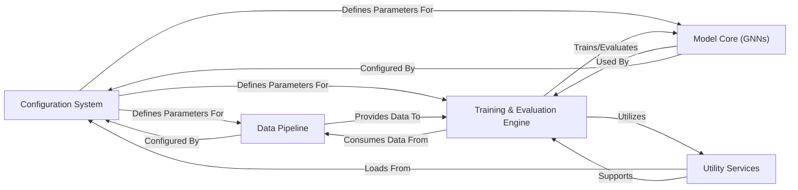

## Details

High-level data flow overview for GearNet, a Deep Learning Research Framework/Library for Protein Representation Learning.

### Configuration System [[Expand]](./Configuration_System.md)
This component serves as the central control for defining and managing all experimental parameters. It leverages YAML files to specify model hyperparameters, dataset paths, training schedules, and task-specific settings, ensuring flexible and reproducible experiment configurations.

**Related Classes/Methods**:

- `config` (1:1)
- <a href="https://github.com/DeepGraphLearning/GearNet/blob/main/util.py#L1-L1" target="_blank" rel="noopener noreferrer">`util` (1:1)</a>

### Data Pipeline [[Expand]](./Data_Pipeline.md)
Responsible for the entire data lifecycle, from acquiring and preprocessing raw protein data (e.g., HDF5 files) to parsing, featurizing atoms and residues, and transforming them into structured protein graphs. It also handles dataset splitting for training, validation, and testing.

**Related Classes/Methods**:

- <a href="https://github.com/DeepGraphLearning/GearNet/blob/main/gearnet/dataset.py#L1-L1" target="_blank" rel="noopener noreferrer">`gearnet.dataset` (1:1)</a>

### Model Core (GNNs) [[Expand]](./Model_Core_GNNs_.md)
This component implements the fundamental graph neural network layers and orchestrates their combination into complete deep learning models for protein representation. It defines how information propagates across protein graphs, incorporating geometric and relational inductive biases.

**Related Classes/Methods**:

- <a href="https://github.com/DeepGraphLearning/GearNet/blob/main/gearnet/layer.py#L1-L1" target="_blank" rel="noopener noreferrer">`gearnet.layer` (1:1)</a>
- <a href="https://github.com/DeepGraphLearning/GearNet/blob/main/gearnet/model.py#L1-L1" target="_blank" rel="noopener noreferrer">`gearnet.model` (1:1)</a>

### Training & Evaluation Engine
Manages the entire model lifecycle, encompassing pre-training, fine-tuning, and evaluation on various protein-related tasks. It sets up and executes training loops, handles validation, testing, metric evaluation, learning rate scheduling, and model checkpointing, often leveraging `torchdrug` solvers.

**Related Classes/Methods**:

- <a href="https://github.com/DeepGraphLearning/GearNet/blob/main/script/pretrain.py#L1-L1" target="_blank" rel="noopener noreferrer">`script.pretrain` (1:1)</a>
- <a href="https://github.com/DeepGraphLearning/GearNet/blob/main/script/downstream.py#L1-L1" target="_blank" rel="noopener noreferrer">`script.downstream` (1:1)</a>
- <a href="https://github.com/DeepGraphLearning/GearNet/blob/main/util.py#L1-L1" target="_blank" rel="noopener noreferrer">`util` (1:1)</a>

### Utility Services [[Expand]](./Utility_Services.md)
Provides foundational helper functions essential for the framework's operation. This includes setting up logging, managing working directories, parsing command-line arguments, and dynamically constructing core framework elements like `torchdrug` solvers and learning rate schedulers based on the loaded configuration.

**Related Classes/Methods**:

- <a href="https://github.com/DeepGraphLearning/GearNet/blob/main/util.py#L1-L1" target="_blank" rel="noopener noreferrer">`util` (1:1)</a>

### [FAQ](https://github.com/CodeBoarding/GeneratedOnBoardings/tree/main?tab=readme-ov-file#faq)