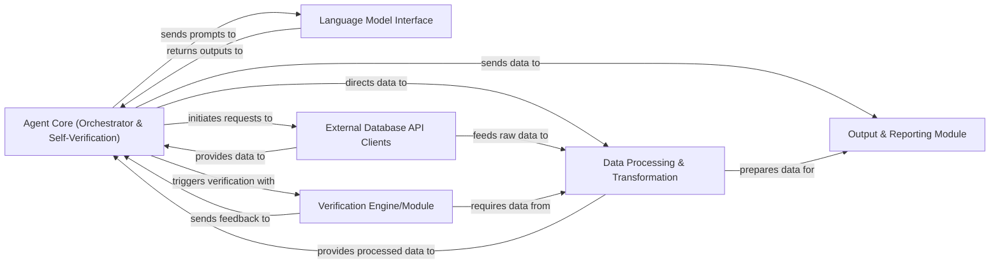

## Details

The GeneAgent system is designed around a central Agent Core that orchestrates complex bioinformatics tasks. This core component interacts with a Language Model Interface for natural language processing capabilities and leverages External Database API Clients to fetch specialized biological data. Data retrieved and processed by these components is then handled by the Data Processing & Transformation module, ensuring data integrity and format consistency. A crucial Verification Engine/Module provides iterative feedback to the Agent Core for self-correction and refinement of results. Finally, the Output & Reporting Module is responsible for presenting the refined insights in a user-friendly format. This architecture emphasizes modularity, allowing for independent development and scaling of each component while maintaining a clear flow of information and control.

### Agent Core (Orchestrator & Self-Verification) [[Expand]](./Agent_Core_Orchestrator_Self_Verification_.md)
The central control unit orchestrating the entire workflow. It handles prompt engineering, manages interactions with the LLM, directs data processing, and integrates a robust self-verification mechanism for iterative refinement and self-correction.

**Related Classes/Methods**:

- `/repo/GeneAgent/main_cascade.py`
- `/repo/GeneAgent/main_CoT.py`
- `/repo/GeneAgent/main_summary.py`
- `/repo/GeneAgent/worker.py`

### Language Model Interface
Manages all communication with the underlying Large Language Model (LLM), handling API calls, request formatting, and response parsing.

**Related Classes/Methods**:

- `/repo/GeneAgent/worker.py`

### External Database API Clients
Provides an interface for interacting with external databases or APIs (e.g., bioinformatics databases), fetching necessary data for the agent's operations.

**Related Classes/Methods**:

- `/repo/GeneAgent/apis/get_complex_for_gene_set.py`

### Verification Engine/Module
Implements the logic for evaluating the quality, accuracy, and correctness of the agent's outputs or intermediate steps, providing feedback to the Agent Core for self-correction.

**Related Classes/Methods**:

- `/repo/GeneAgent/main_cascade.py`

### Data Processing & Transformation
Handles the cleaning, transformation, and preparation of data, both input data for the LLM and output data from the LLM, ensuring it's in the correct format for subsequent steps or external systems.

**Related Classes/Methods**:

- `/repo/GeneAgent/worker.py`

### Output & Reporting Module
Responsible for formatting, presenting, and storing the final results generated by the agent, potentially including summaries, reports, or structured data.

**Related Classes/Methods**:

- `/repo/GeneAgent/main_summary.py`

### [FAQ](https://github.com/CodeBoarding/GeneratedOnBoardings/tree/main?tab=readme-ov-file#faq)