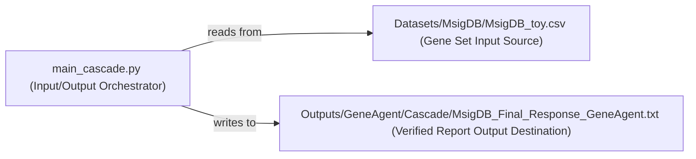

## Details

The `Input/Output Handler` subsystem of the GeneAgent is primarily composed of three key components: `main_cascade.py`, acting as the central orchestrator; `Datasets/MsigDB/MsigDB_toy.csv`, serving as the structured input source for gene sets; and `Outputs/GeneAgent/Cascade/MsigDB_Final_Response_GeneAgent.txt`, designated as the final output destination for verified reports. The `main_cascade.py` script is responsible for reading initial data from the input CSV file, processing it (implicitly involving agent interactions), and then persisting the generated reports into the specified text file, thereby defining a clear and essential data flow for the GeneAgent's operation.

### main_cascade.py (Input/Output Orchestrator)
This Python script is the central operational component of the `Input/Output Handler` subsystem. It orchestrates the entire data flow, from reading initial gene sets from input sources to writing the final, verified reports to output destinations. For a Language Agent, it implicitly manages the initial prompts provided to the agent and captures the structured or unstructured responses generated by the agent, acting as the primary interface for interaction.

**Related Classes/Methods**:

- <a href="https://github.com/ncbi-nlp/GeneAgent/blob/main/main_cascade.py" target="_blank" rel="noopener noreferrer">`main_cascade.py`</a>

### Datasets/MsigDB/MsigDB_toy.csv (Gene Set Input Source)
This component represents the structured file-based input source for the GeneAgent system. It contains the initial gene sets that are required for the agent's analysis and verification process. It serves as a static data repository from which the `Input/Output Orchestrator` retrieves raw input.

**Related Classes/Methods**:

- <a href="https://github.com/ncbi-nlp/GeneAgent/blob/main/Datasets/MsigDB/MsigDB_toy.csv" target="_blank" rel="noopener noreferrer">`MsigDB_toy.csv`</a>

### Outputs/GeneAgent/Cascade/MsigDB_Final_Response_GeneAgent.txt (Verified Report Output Destination)
This component serves as the designated file-based destination for the final, verified reports generated by the GeneAgent. It is where the `Input/Output Orchestrator` persists the processed and validated results, making them available for external review or subsequent system integration.

**Related Classes/Methods**:

- <a href="https://github.com/ncbi-nlp/GeneAgent/blob/main/Outputs/GeneAgent/Cascade/MsigDB_Final_Response_GeneAgent.txt" target="_blank" rel="noopener noreferrer">`MsigDB_Final_Response_GeneAgent.txt`</a>

### [FAQ](https://github.com/CodeBoarding/GeneratedOnBoardings/tree/main?tab=readme-ov-file#faq)