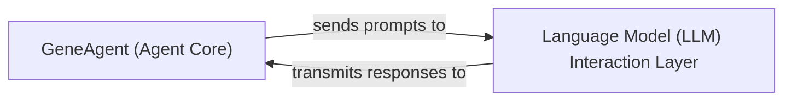

## Details

This section details the core architectural components of the `GeneAgent` project, focusing on their responsibilities, key source files, and interactions, aligned with AI/ML Application (Language Agent) patterns. The `GeneAgent` (Agent Core) is the central orchestrator and decision-making component, acting as the 'brain' of the application. The `Language Model (LLM) Interaction Layer` is crucial for abstracting the complexities of interacting with external LLM services. The `main_cascade.py` file appears to be central to both components, suggesting it might contain the primary orchestration logic for the `GeneAgent` and the specific methods for LLM interaction.

### GeneAgent (Agent Core)
The central orchestrator and decision-making component of the system. It is responsible for generating structured prompts based on internal logic and external inputs, initiating communication with the Language Model (LLM) Interaction Layer, and processing the responses received to guide subsequent actions or refine its internal state. This component embodies the iterative and self-correcting nature of the agent.

**Related Classes/Methods**:

- <a href="https://github.com/ncbi-nlp/GeneAgent/blob/main/main_cascade.py" target="_blank" rel="noopener noreferrer">`main_cascade`</a>

### Language Model (LLM) Interaction Layer [[Expand]](./Language_Model_LLM_Interaction_Layer.md)
This component serves as the dedicated interface for all direct communication with external Large Language Models (LLMs), such as OpenAI's GPT models. Its primary responsibilities include the precise formatting and transmission of structured prompts originating from the `GeneAgent` (Agent Core) and the subsequent parsing of raw text responses received from the LLM, preparing them for consumption by the `GeneAgent`.

**Related Classes/Methods**:

- <a href="https://github.com/ncbi-nlp/GeneAgent/blob/main/main_cascade.py" target="_blank" rel="noopener noreferrer">`GeneAgent.main_cascade`</a>

### [FAQ](https://github.com/CodeBoarding/GeneratedOnBoardings/tree/main?tab=readme-ov-file#faq)