```mermaid
graph LR
    Input_Output_Handler["Input/Output Handler"]
    Agent_Core_Orchestrator_Self_Verification_["Agent Core (Orchestrator & Self-Verification)"]
    Language_Model_LLM_Interaction_Layer["Language Model (LLM) Interaction Layer"]
    Bioinformatics_Data_Access_Layer["Bioinformatics Data Access Layer"]
    Data_Processing_Claim_Generation["Data Processing & Claim Generation"]
    Input_Output_Handler -- "initiates query to" --> Agent_Core_Orchestrator_Self_Verification_
    Agent_Core_Orchestrator_Self_Verification_ -- "sends prompts to" --> Language_Model_LLM_Interaction_Layer
    Language_Model_LLM_Interaction_Layer -- "returns responses to" --> Agent_Core_Orchestrator_Self_Verification_
    Agent_Core_Orchestrator_Self_Verification_ -- "requests data from" --> Data_Processing_Claim_Generation
    Data_Processing_Claim_Generation -- "retrieves data via" --> Bioinformatics_Data_Access_Layer
    Bioinformatics_Data_Access_Layer -- "provides raw data to" --> Data_Processing_Claim_Generation
    Data_Processing_Claim_Generation -- "sends processed data/verification results to" --> Agent_Core_Orchestrator_Self_Verification_
    Agent_Core_Orchestrator_Self_Verification_ -- "sends final results to" --> Input_Output_Handler
    click Input_Output_Handler href "https://github.com/CodeBoarding/GeneratedOnBoardings/blob/main/GeneAgent/Input_Output_Handler.md" "Details"
    click Agent_Core_Orchestrator_Self_Verification_ href "https://github.com/CodeBoarding/GeneratedOnBoardings/blob/main/GeneAgent/Agent_Core_Orchestrator_Self_Verification_.md" "Details"
    click Language_Model_LLM_Interaction_Layer href "https://github.com/CodeBoarding/GeneratedOnBoardings/blob/main/GeneAgent/Language_Model_LLM_Interaction_Layer.md" "Details"
```

## Details

The GeneAgent system operates as a sophisticated, self-correcting agent designed for bioinformatics analysis. At its core, the Agent Core (Orchestrator & Self-Verification) manages the entire analytical workflow, from initial prompt engineering and interaction with external Language Models to iterative refinement and self-correction. It leverages a dedicated Language Model (LLM) Interaction Layer for all communications with large language models. Data acquisition is handled by the Bioinformatics Data Access Layer, which provides access to various biological databases. The retrieved data is then processed and contextualized by the Data Processing & Claim Generation component, which also formulates claims for the Agent Core's integrated self-verification mechanism. Finally, the Input/Output Handler manages the ingestion of initial gene sets and the generation of comprehensive final reports, serving as the system's primary interface for data flow.

### Input/Output Handler [[Expand]](./Input_Output_Handler.md)
Manages the ingestion of initial gene sets from structured files and the generation of final, verified reports. It represents the system's boundary for data input and output.

**Related Classes/Methods**:

- <a href="https://github.com/ncbi-nlp/GeneAgent/blob/main/main_cascade.py" target="_blank" rel="noopener noreferrer">`main_cascade.py`</a>
- <a href="https://github.com/ncbi-nlp/GeneAgent/blob/main/Datasets/MsigDB/MsigDB_toy.csv" target="_blank" rel="noopener noreferrer">`Datasets/MsigDB/MsigDB_toy.csv`</a>

### Agent Core (Orchestrator & Self-Verification) [[Expand]](./Agent_Core_Orchestrator_Self_Verification_.md)
The central control unit orchestrating the entire workflow. It handles prompt engineering, manages interactions with the LLM, directs data processing, and integrates a robust self-verification mechanism for iterative refinement and self-correction. The `main_cascade.py` file is central to implementing both orchestration and self-verification logic.

**Related Classes/Methods**:

- <a href="https://github.com/ncbi-nlp/GeneAgent/blob/main/main_CoT.py" target="_blank" rel="noopener noreferrer">`main_CoT.py`</a>
- <a href="https://github.com/ncbi-nlp/GeneAgent/blob/main/main_cascade.py" target="_blank" rel="noopener noreferrer">`main_cascade.py`</a>
- <a href="https://github.com/ncbi-nlp/GeneAgent/blob/main/main_summary.py" target="_blank" rel="noopener noreferrer">`main_summary.py`</a>
- <a href="https://github.com/ncbi-nlp/GeneAgent/blob/main/worker.py" target="_blank" rel="noopener noreferrer">`worker.py`</a>

### Language Model (LLM) Interaction Layer [[Expand]](./Language_Model_LLM_Interaction_Layer.md)
Manages all direct communication with external Large Language Models (e.g., OpenAI's GPT models). It is responsible for sending structured prompts generated by the Agent Core and parsing the raw text responses received from the LLM.

**Related Classes/Methods**:

- <a href="https://github.com/ncbi-nlp/GeneAgent/blob/main/main_cascade.py" target="_blank" rel="noopener noreferrer">`main_cascade.py`</a>

### Bioinformatics Data Access Layer
A collection of specialized API clients for securely accessing and retrieving diverse biological data from various external bioinformatics databases and services. Each script in the `apis` directory represents a specific data retrieval function.

**Related Classes/Methods**:

- <a href="https://github.com/ncbi-nlp/GeneAgent/blob/main/apis/get_complex_for_gene_set.py" target="_blank" rel="noopener noreferrer">`apis/get_complex_for_gene_set.py`</a>
- <a href="https://github.com/ncbi-nlp/GeneAgent/blob/main/apis/get_disease_for_single_gene.py" target="_blank" rel="noopener noreferrer">`apis/get_disease_for_single_gene.py`</a>
- <a href="https://github.com/ncbi-nlp/GeneAgent/blob/main/apis/get_domain_for_single_gene.py" target="_blank" rel="noopener noreferrer">`apis/get_domain_for_single_gene.py`</a>
- <a href="https://github.com/ncbi-nlp/GeneAgent/blob/main/apis/get_enrichment_for_gene_set.py" target="_blank" rel="noopener noreferrer">`apis/get_enrichment_for_gene_set.py`</a>
- <a href="https://github.com/ncbi-nlp/GeneAgent/blob/main/apis/get_gene_summary_for_single_gene.py" target="_blank" rel="noopener noreferrer">`apis/get_gene_summary_for_single_gene.py`</a>
- <a href="https://github.com/ncbi-nlp/GeneAgent/blob/main/apis/get_interactions_for_gene_set.py" target="_blank" rel="noopener noreferrer">`apis/get_interactions_for_gene_set.py`</a>
- <a href="https://github.com/ncbi-nlp/GeneAgent/blob/main/apis/get_pathway_for_gene_set.py" target="_blank" rel="noopener noreferrer">`apis/get_pathway_for_gene_set.py`</a>
- <a href="https://github.com/ncbi-nlp/GeneAgent/blob/main/apis/get_pubmed_articles.py" target="_blank" rel="noopener noreferrer">`apis/get_pubmed_articles.py`</a>

### Data Processing & Claim Generation
Responsible for transforming raw data into a structured, contextualized format suitable for the LLM and for generating decontextualized claims from LLM responses that require verification. This module is critical for preparing data for the Agent Core's reasoning and self-correction processes.

**Related Classes/Methods**:

- <a href="https://github.com/ncbi-nlp/GeneAgent/blob/main/worker.py" target="_blank" rel="noopener noreferrer">`worker.py`</a>
- <a href="https://github.com/ncbi-nlp/GeneAgent/blob/main/main_cascade.py" target="_blank" rel="noopener noreferrer">`main_cascade.py`</a>

### [FAQ](https://github.com/CodeBoarding/GeneratedOnBoardings/tree/main?tab=readme-ov-file#faq)