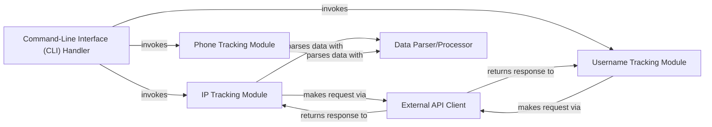

## Details

The GhostTR application is structured around a Command-Line Interface (CLI) Handler that serves as the primary user interaction point, orchestrating various tracking functionalities. Users select from options to track IP addresses, phone numbers, or usernames. The IP Tracking Module and Username Tracking Module interact with an External API Client to fetch OSINT data from various web services. The External API Client, leveraging the `requests` library, handles the low-level HTTP communications. Upon receiving raw data, the Data Parser/Processor, which includes functionalities like JSON parsing and the `phonenumbers` library, processes and structures this information for display. The Phone Tracking Module directly utilizes the Data Parser/Processor (specifically the `phonenumbers` library) for its analysis without an explicit external API call in the same manner as IP or Username tracking.

### Command-Line Interface (CLI) Handler
Manages user input, parses commands and arguments, and orchestrates the execution flow of the tool based on user requests. It is the primary interface for user interaction.

**Related Classes/Methods**:

- <a href="https://github.com/HunxByts/GhostTrack/blob/main/GhostTR.py#L296-L306" target="_blank" rel="noopener noreferrer">`GhostTR.main`:296-306</a>
- <a href="https://github.com/HunxByts/GhostTrack/blob/main/GhostTR.py#L259-L272" target="_blank" rel="noopener noreferrer">`GhostTR.option`:259-272</a>
- <a href="https://github.com/HunxByts/GhostTrack/blob/main/GhostTR.py#L230-L242" target="_blank" rel="noopener noreferrer">`GhostTR.execute_option`:230-242</a>
- <a href="https://github.com/HunxByts/GhostTrack/blob/main/GhostTR.py#L219-L227" target="_blank" rel="noopener noreferrer">`GhostTR.call_option`:219-227</a>
- <a href="https://github.com/HunxByts/GhostTrack/blob/main/GhostTR.py#L30-L36" target="_blank" rel="noopener noreferrer">`GhostTR.is_option`:30-36</a>

### IP Tracking Module
Encapsulates the logic for gathering and processing information related to IP addresses. It interacts with the External API Client to fetch data from IP-specific OSINT services and then uses the Data Parser/Processor to structure the response.

**Related Classes/Methods**:

- <a href="https://github.com/HunxByts/GhostTrack/blob/main/GhostTR.py#L40-L77" target="_blank" rel="noopener noreferrer">`GhostTR.IP_Track`:40-77</a>

### Phone Tracking Module [[Expand]](./Phone_Tracking_Module.md)
Handles the functionality for tracking and analyzing phone numbers. It directly uses the phonenumbers library (part of the Data Parser/Processor) for local parsing and information extraction.

**Related Classes/Methods**:

- <a href="https://github.com/HunxByts/GhostTrack/blob/main/GhostTR.py#L80-L118" target="_blank" rel="noopener noreferrer">`GhostTR.phoneGW`:80-118</a>

### Username Tracking Module [[Expand]](./Username_Tracking_Module.md)
Provides capabilities for searching and gathering information associated with usernames across various platforms. It interacts with the External API Client to query various social media and online services.

**Related Classes/Methods**:

- <a href="https://github.com/HunxByts/GhostTrack/blob/main/GhostTR.py#L121-L166" target="_blank" rel="noopener noreferrer">`GhostTR.TrackLu`:121-166</a>

### External API Client [[Expand]](./External_API_Client.md)
Manages all interactions with external web services and APIs, specifically handling HTTP GET requests using the requests library. It is responsible for sending requests and receiving raw data responses. This component is implemented through direct calls to the requests library within the tracking modules.

**Related Classes/Methods**:

- <a href="https://github.com/HunxByts/GhostTrack/blob/main/GhostTR.py#L169-L176" target="_blank" rel="noopener noreferrer">`GhostTR.showIP`:169-176</a>

### Data Parser/Processor
Responsible for parsing raw data received from external APIs into a structured format and extracting relevant information. This includes JSON parsing for IP data and specialized parsing for phone numbers using the phonenumbers library.

**Related Classes/Methods**:

### [FAQ](https://github.com/CodeBoarding/GeneratedOnBoardings/tree/main?tab=readme-ov-file#faq)