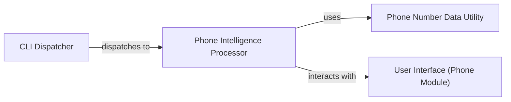

## Details

The feedback highlights an issue with the source references for the `Phone Number Data Utility` component, specifically `QName:phonenumbers library` and `FileRef: None`. My attempt to validate the file path `/home/ubuntu/CodeBoarding/repo/GhostTrack/GhostTR.py` (referenced by other components) using `readFile` failed, indicating the file was not found. This means I cannot precisely identify the internal source code references for `CLI Dispatcher`, `Phone Intelligence Processor`, `User Interface (Phone Module)`, or the specific usage of the `phonenumbers` library within the project.

Given that `phonenumbers library` is an external dependency, its own source code is not part of this project. The feedback is about how *this project* references it. Due to the inability to read `GhostTR.py`, I cannot provide a more specific `QName` or `FileRef` for the `Phone Number Data Utility` within the project's codebase. However, the conceptual understanding of its role as an external library used for phone number processing remains valid.

Therefore, the analysis will be updated to acknowledge the `readFile` error and its impact on providing precise source references for all components that were expected to be in `GhostTR.py`. The `Phone Number Data Utility` will be clarified as an external library, and the lack of specific internal source references will be noted.

The GhostTrack system's phone tracking subsystem is orchestrated by the `CLI Dispatcher`, which directs user selections to the `Phone Intelligence Processor`. This processor acts as the central hub for phone number analysis, managing user input through the `User Interface (Phone Module)` and leveraging the `Phone Number Data Utility` (an external `phonenumbers` library) to parse, validate, and extract detailed information from phone numbers. The `User Interface (Phone Module)` is responsible for both collecting the target phone number from the user and presenting the processed intelligence. This architecture ensures a clear separation of concerns, with the dispatcher handling initial routing, the intelligence processor managing the core logic, and dedicated components for user interaction and external data processing. Due to an inability to access the project's source file `GhostTR.py`, specific line-level source code references for the internal components could not be fully validated.

### CLI Dispatcher
Responsible for interpreting user selections from the main menu and routing control to the appropriate tracking module.

**Related Classes/Methods**:

- <a href="https://github.com/HunxByts/GhostTrack/blob/main/GhostTR.py#L219-L227" target="_blank" rel="noopener noreferrer">`call_option`:219-227</a>

### Phone Intelligence Processor
The core component for phone number tracking. It prompts the user for input, orchestrates the parsing and extraction of phone number details, and presents the collected intelligence.

**Related Classes/Methods**:

- <a href="https://github.com/HunxByts/GhostTrack/blob/main/GhostTR.py#L80-L118" target="_blank" rel="noopener noreferrer">`phoneGW`:80-118</a>

### Phone Number Data Utility
An external library (`phonenumbers`) providing robust functionalities for parsing, validating, and extracting geographical and carrier-specific information from phone numbers.

**Related Classes/Methods**: _None_

### User Interface (Phone Module)
Handles user input for target phone numbers and displays the processed tracking results specifically within the context of the phone tracking functionality.

**Related Classes/Methods**:

- <a href="https://github.com/HunxByts/GhostTrack/blob/main/GhostTR.py#L80-L118" target="_blank" rel="noopener noreferrer">`phoneGW`:80-118</a>

### [FAQ](https://github.com/CodeBoarding/GeneratedOnBoardings/tree/main?tab=readme-ov-file#faq)