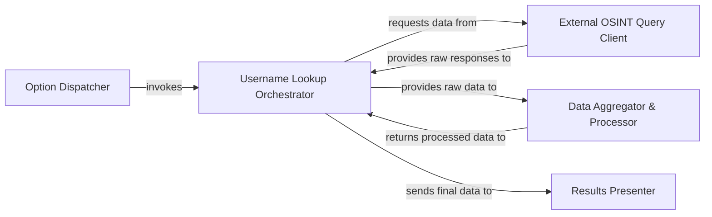

## Details

The GhostTrack username OSINT subsystem initiates with the Option Dispatcher, which directs user-selected actions. For username tracking, it invokes the Username Lookup Orchestrator. This orchestrator is central to the process, managing the querying of various social media platforms through the External OSINT Query Client. Raw responses from these external sources are then provided back to the orchestrator. The orchestrator subsequently provides this raw data to the Data Aggregator & Processor, which structures and refines the information, returning processed data to the orchestrator. Finally, the Username Lookup Orchestrator sends the consolidated findings to the Results Presenter for display to the user.

### Option Dispatcher
This component serves as the initial entry point for the username tracking functionality. It receives the user's command-line input for OSINT operations and dispatches the request to the appropriate core lookup logic.

**Related Classes/Methods**:

- <a href="https://github.com/HunxByts/GhostTrack/blob/main/GhostTR.py#L219-L227" target="_blank" rel="noopener noreferrer">`GhostTR.call_option`:219-227</a>

### Username Lookup Orchestrator
This is the central coordinating component of the subsystem. It receives a username, manages the workflow of querying external sources, collects and aggregates the raw data, and oversees its processing and final presentation.

**Related Classes/Methods**:

- <a href="https://github.com/HunxByts/GhostTrack/blob/main/GhostTR.py#L121-L166" target="_blank" rel="noopener noreferrer">`GhostTR.TrackLu`:121-166</a>

### External OSINT Query Client
Responsible for abstracting the details of interacting with various external online platforms and OSINT APIs. It handles sending specific queries for username information and retrieving raw responses from these diverse sources.

**Related Classes/Methods**:

- <a href="https://github.com/HunxByts/GhostTrack/blob/main/GhostTR.py" target="_blank" rel="noopener noreferrer">`requests.get`</a>

### Data Aggregator & Processor
This component takes the raw, potentially disparate data received from various external OSINT sources. It aggregates, filters, and transforms this data into a consistent and usable format, preparing it for analysis and presentation.

**Related Classes/Methods**:

- <a href="https://github.com/HunxByts/GhostTrack/blob/main/GhostTR.py#L121-L166" target="_blank" rel="noopener noreferrer">`GhostTR.TrackLu`:121-166</a>

### Results Presenter
Focuses on formatting and displaying the consolidated and processed OSINT findings to the user. It ensures that the output is clear, readable, and effectively communicates the gathered intelligence through the command-line interface.

**Related Classes/Methods**:

- <a href="https://github.com/HunxByts/GhostTrack/blob/main/GhostTR.py#L121-L166" target="_blank" rel="noopener noreferrer">`GhostTR.TrackLu`:121-166</a>

### [FAQ](https://github.com/CodeBoarding/GeneratedOnBoardings/tree/main?tab=readme-ov-file#faq)