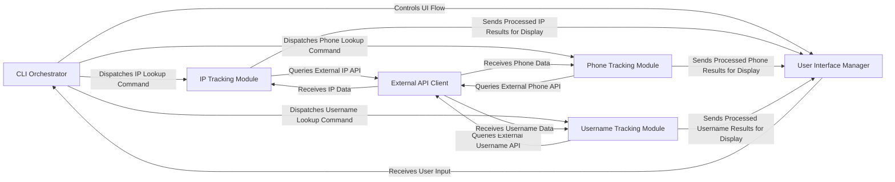

## Details

The GhostTrack architecture is a functionally decomposed CLI tool designed for Open Source Intelligence gathering. At its core, the CLI Orchestrator acts as the central command and control, managing user interaction and dispatching tasks. It relies on the User Interface Manager for all input/output operations, ensuring a consistent user experience. Specialized IP Tracking, Phone Tracking, and Username Tracking Modules handle the distinct OSINT functionalities, each responsible for orchestrating data collection and processing for their respective domains. These tracking modules uniformly interact with the External API Client, which serves as the sole gateway for querying various external OSINT services. This clear separation of concerns facilitates maintainability and allows for easy extension of tracking capabilities or integration with new external data sources, all while maintaining a user-driven, interactive flow.

### CLI Orchestrator
The central control unit managing the application's lifecycle, user input processing, and command dispatching.

**Related Classes/Methods**:

- <a href="https://github.com/HunxByts/GhostTrack/blob/main/GhostTR.py#L296-L306" target="_blank" rel="noopener noreferrer">`main`:296-306</a>
- <a href="https://github.com/HunxByts/GhostTrack/blob/main/GhostTR.py#L31-L33" target="_blank" rel="noopener noreferrer">`wrapper`:31-33</a>
- <a href="https://github.com/HunxByts/GhostTrack/blob/main/GhostTR.py#L230-L242" target="_blank" rel="noopener noreferrer">`execute_option`:230-242</a>
- <a href="https://github.com/HunxByts/GhostTrack/blob/main/GhostTR.py#L219-L227" target="_blank" rel="noopener noreferrer">`call_option`:219-227</a>
- <a href="https://github.com/HunxByts/GhostTrack/blob/main/GhostTR.py#L252-L256" target="_blank" rel="noopener noreferrer">`is_in_options`:252-256</a>

### User Interface Manager
Handles all console-based interactions, including displaying banners, menus, and formatting output for the user.

**Related Classes/Methods**:

- <a href="https://github.com/HunxByts/GhostTrack/blob/main/GhostTR.py#L275-L293" target="_blank" rel="noopener noreferrer">`run_banner`:275-293</a>
- <a href="https://github.com/HunxByts/GhostTrack/blob/main/GhostTR.py#L210-L216" target="_blank" rel="noopener noreferrer">`clear`:210-216</a>
- <a href="https://github.com/HunxByts/GhostTrack/blob/main/GhostTR.py#L30-L36" target="_blank" rel="noopener noreferrer">`option`:30-36</a>
- <a href="https://github.com/HunxByts/GhostTrack/blob/main/GhostTR.py#L245-L249" target="_blank" rel="noopener noreferrer">`option_text`:245-249</a>

### IP Tracking Module
Specializes in gathering and processing information related to IP addresses by orchestrating calls to external services.

**Related Classes/Methods**:

- <a href="https://github.com/HunxByts/GhostTrack/blob/main/GhostTR.py" target="_blank" rel="noopener noreferrer">`call_option:ip_lookup_function`</a>

### Phone Tracking Module [[Expand]](./Phone_Tracking_Module.md)
Focuses on collecting and analyzing data associated with phone numbers through integration with external intelligence services.

**Related Classes/Methods**:

- <a href="https://github.com/HunxByts/GhostTrack/blob/main/GhostTR.py" target="_blank" rel="noopener noreferrer">`call_option:phone_lookup_function`</a>

### Username Tracking Module [[Expand]](./Username_Tracking_Module.md)
Performs OSINT on usernames across various online platforms by querying external sources for linked information.

**Related Classes/Methods**:

- <a href="https://github.com/HunxByts/GhostTrack/blob/main/GhostTR.py" target="_blank" rel="noopener noreferrer">`call_option:username_lookup_function`</a>

### External API Client [[Expand]](./External_API_Client.md)
Provides an abstract interface for all interactions with external web services and APIs, handling low-level HTTP requests and response management.

**Related Classes/Methods**:

- <a href="https://github.com/HunxByts/GhostTrack/blob/main/GhostTR.py" target="_blank" rel="noopener noreferrer">`make_api_request`</a>
- <a href="https://github.com/HunxByts/GhostTrack/blob/main/GhostTR.py" target="_blank" rel="noopener noreferrer">`fetch_url_data`</a>

### [FAQ](https://github.com/CodeBoarding/GeneratedOnBoardings/tree/main?tab=readme-ov-file#faq)