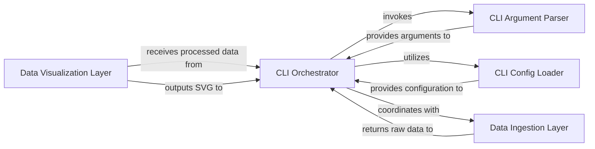

## Details

The `GitHubPoster` CLI tool's architecture is centered around the `CLI Orchestrator`, which serves as the primary control unit. It initiates the application by parsing command-line arguments via the `CLI Argument Parser` and loading necessary configurations through the `CLI Config Loader`. Once configured, the orchestrator directs the `Data Ingestion Layer` to fetch raw data from external sources. This raw data is then processed and passed to the `Data Visualization Layer`, which is responsible for generating the final SVG output. The `CLI Orchestrator` then handles the output of this generated SVG. This design ensures a clear separation of concerns, with distinct components handling argument parsing, configuration, data acquisition, and visual rendering, all coordinated by the central orchestrator.

### CLI Orchestrator [[Expand]](./CLI_Orchestrator.md)
The application's entry point, responsible for argument parsing, configuration loading, and coordinating the overall data flow from data ingestion to rendering and output. It acts as the central coordinator for the GitHubPoster CLI tool.

**Related Classes/Methods**:

- <a href="https://github.com/yihong0618/GitHubPoster/blob/main/github_poster/cli.py" target="_blank" rel="noopener noreferrer">`github_poster.cli:main`</a>
- <a href="https://github.com/yihong0618/GitHubPoster/blob/main/github_poster/cli.py" target="_blank" rel="noopener noreferrer">`github_poster.cli:run`</a>

### CLI Argument Parser
Component responsible for parsing and validating command-line arguments provided by the user.

**Related Classes/Methods**:

- <a href="https://github.com/yihong0618/GitHubPoster/blob/main/github_poster/cli.py#L23-L41" target="_blank" rel="noopener noreferrer">`argparse.ArgumentParser`:23-41</a>

### CLI Config Loader
Component responsible for loading and managing application configuration, often from files or environment variables.

**Related Classes/Methods**:

- <a href="https://github.com/yihong0618/GitHubPoster/blob/main/github_poster/cli.py" target="_blank" rel="noopener noreferrer">`github_poster.config`</a>

### Data Ingestion Layer
Component responsible for fetching raw data from external sources (e.g., GitHub API).

**Related Classes/Methods**:

- <a href="https://github.com/yihong0618/GitHubPoster/blob/main/github_poster/loader#L13-L88" target="_blank" rel="noopener noreferrer">`github_poster.loader`:13-88</a>

### Data Visualization Layer
Component responsible for processing the ingested data and generating the final SVG output.

**Related Classes/Methods**:

- <a href="https://github.com/yihong0618/GitHubPoster/blob/main/github_poster/drawer.py#L17-L273" target="_blank" rel="noopener noreferrer">`github_poster.drawer.Drawer`:17-273</a>
- <a href="https://github.com/yihong0618/GitHubPoster/blob/main/github_poster/circluar_drawer.py#L14-L181" target="_blank" rel="noopener noreferrer">`github_poster.circluar_drawer.CircularDrawer`:14-181</a>

### [FAQ](https://github.com/CodeBoarding/GeneratedOnBoardings/tree/main?tab=readme-ov-file#faq)