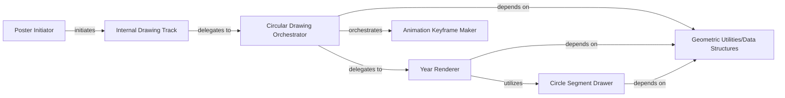

## Details

The `Circular Poster Renderer` subsystem is responsible for generating SVG visualizations in a circular format, specifically designed for displaying annual or cyclical activity patterns by arranging data points radially.

### Poster Initiator
Acts as the entry point from the main Poster class for circular poster generation. It initializes the SVG drawing canvas, sets the background, and then delegates the detailed drawing to the Internal Drawing Track.

**Related Classes/Methods**:

- <a href="https://github.com/yihong0618/GitHubPoster/blob/main/github_poster/poster.py" target="_blank" rel="noopener noreferrer">`github_poster.poster:_draw_circular`</a>

### Internal Drawing Track
A generic internal method within the Poster class that serves as an abstraction layer. It dispatches the actual drawing operation to the currently selected tracks_drawer (which is an instance of CircularDrawer in this subsystem's context).

**Related Classes/Methods**:

- <a href="https://github.com/yihong0618/GitHubPoster/blob/main/github_poster/poster.py" target="_blank" rel="noopener noreferrer">`github_poster.poster:__draw_tracks`</a>

### Circular Drawing Orchestrator
Serves as the primary controller for generating the circular SVG poster. It manages the overall drawing flow, including setting up animation keyframes and delegating the rendering of individual years.

**Related Classes/Methods**:

- <a href="https://github.com/yihong0618/GitHubPoster/blob/main/github_poster/circluar_drawer.py" target="_blank" rel="noopener noreferrer">`github_poster.circluar_drawer.CircularDrawer:draw`</a>

### Year Renderer
Focuses on rendering the visual elements for a single year within the circular poster. This includes drawing year and month labels, and delegating the drawing of daily data segments.

**Related Classes/Methods**:

- <a href="https://github.com/yihong0618/GitHubPoster/blob/main/github_poster/circluar_drawer.py" target="_blank" rel="noopener noreferrer">`github_poster.circluar_drawer.CircularDrawer:_draw_year`</a>

### Circle Segment Drawer
Draws individual circular segments, each representing a specific daily activity data point. It calculates the segment's shape and color based on the input data and predefined ranges.

**Related Classes/Methods**:

- <a href="https://github.com/yihong0618/GitHubPoster/blob/main/github_poster/circluar_drawer.py" target="_blank" rel="noopener noreferrer">`github_poster.circluar_drawer.CircularDrawer:_draw_circle_segment`</a>

### Animation Keyframe Maker
Generates the necessary SVG animation keyframes and timing sequences to create a year-by-year animation effect on the circular poster. _make_key_animate constructs the SVG animate element, while make_key_times calculates the precise timing for these animations.

**Related Classes/Methods**:

- <a href="https://github.com/yihong0618/GitHubPoster/blob/main/github_poster/circluar_drawer.py" target="_blank" rel="noopener noreferrer">`github_poster.circluar_drawer.CircularDrawer:_make_key_animate`</a>
- <a href="https://github.com/yihong0618/GitHubPoster/blob/main/github_poster/utils.py" target="_blank" rel="noopener noreferrer">`github_poster.utils:make_key_times`</a>

### Geometric Utilities/Data Structures
Offers foundational data structures for representing 2D coordinates (XY) and value ranges (ValueRange). These are critical for all geometric calculations, positioning, and sizing within the SVG output.

**Related Classes/Methods**:

- <a href="https://github.com/yihong0618/GitHubPoster/blob/main/github_poster/structures.py" target="_blank" rel="noopener noreferrer">`github_poster.structures:XY`</a>
- <a href="https://github.com/yihong0618/GitHubPoster/blob/main/github_poster/structures.py" target="_blank" rel="noopener noreferrer">`github_poster.structures:ValueRange`</a>

### [FAQ](https://github.com/CodeBoarding/GeneratedOnBoardings/tree/main?tab=readme-ov-file#faq)