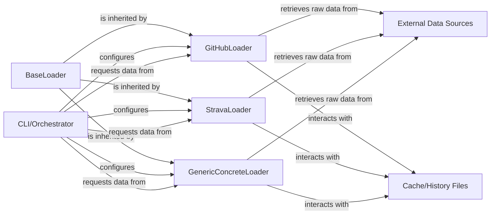

## Details

This subsystem focuses on the robust and extensible data loading mechanism for the github_poster project. It is designed around an abstract BaseLoader that defines a common interface for fetching and normalizing activity data from various external sources. Concrete implementations, such as GitHubLoader, StravaLoader, and other GenericConcreteLoader instances, extend this base to handle specific API interactions and data formats. The CLI/Orchestrator acts as the primary consumer, initiating data requests and configuring the appropriate loaders. Data persistence and historical tracking are managed through Cache/History Files, while raw data is retrieved from diverse External Data Sources. This architecture ensures modularity, allowing easy integration of new data sources without altering the core processing logic.

### BaseLoader
Defines the abstract interface and common functionalities for all data loaders. It establishes a standardized contract for fetching and normalizing activity data, including dependency checks and year list generation, ensuring consistency across different data sources.

**Related Classes/Methods**:

- <a href="https://github.com/yihong0618/GitHubPoster/blob/main/github_poster/loader/base_loader.py#L16-L233" target="_blank" rel="noopener noreferrer">`github_poster.loader.base_loader.BaseLoader`:16-233</a>

### GitHubLoader
A concrete data adapter responsible for fetching raw activity data specifically from the GitHub API. It handles GitHub-specific API interactions, authentication, and parsing, then normalizes the data into the consistent internal format defined by BaseLoader.

**Related Classes/Methods**:

- <a href="https://github.com/yihong0618/GitHubPoster/blob/main/github_poster/loader/github_loader.py#L10-L56" target="_blank" rel="noopener noreferrer">`github_poster.loader.github_loader.GitHubLoader`:10-56</a>

### StravaLoader
A concrete data adapter dedicated to fetching raw activity data from the Strava API. It manages Strava-specific API calls, token management, and data parsing, subsequently normalizing the data to align with the BaseLoader's defined structure.

**Related Classes/Methods**:

- <a href="https://github.com/yihong0618/GitHubPoster/blob/main/github_poster/loader/strava_loader.py#L8-L95" target="_blank" rel="noopener noreferrer">`github_poster.loader.strava_loader.StravaLoader`:8-95</a>

### GenericConcreteLoader
This represents the pattern for other concrete data loaders (e.g., AutoSleep, Apple Health, Bilibili, Garmin, Leetcode, Todoist, Wakatime). Each GenericConcreteLoader connects to its respective external service, fetches raw data, and normalizes it into the consistent internal format, adhering to the BaseLoader interface.

**Related Classes/Methods**:

- <a href="https://github.com/yihong0618/GitHubPoster/blob/main/github_poster/loader/autosleep_loader.py#L8-L56" target="_blank" rel="noopener noreferrer">`github_poster.loader.autosleep_loader.AutoSleepLoader`:8-56</a>
- <a href="https://github.com/yihong0618/GitHubPoster/blob/main/github_poster/loader/apple_health_loader.py#L35-L141" target="_blank" rel="noopener noreferrer">`github_poster.loader.applehealth_loader.AppleHealthLoader`:35-141</a>
- <a href="https://github.com/yihong0618/GitHubPoster/blob/main/github_poster/loader/bilibili_loader.py#L13-L94" target="_blank" rel="noopener noreferrer">`github_poster.loader.bilibili_loader.BilibiliLoader`:13-94</a>
- <a href="https://github.com/yihong0618/GitHubPoster/blob/main/github_poster/loader/garmin_loader.py#L7-L85" target="_blank" rel="noopener noreferrer">`github_poster.loader.garmin_loader.GarminLoader`:7-85</a>
- <a href="https://github.com/yihong0618/GitHubPoster/blob/main/github_poster/loader/leetcode_loader.py#L13-L80" target="_blank" rel="noopener noreferrer">`github_poster.loader.leetcode_loader.LeetcodeLoader`:13-80</a>
- <a href="https://github.com/yihong0618/GitHubPoster/blob/main/github_poster/loader/todoist_loader.py#L13-L142" target="_blank" rel="noopener noreferrer">`github_poster.loader.todoist_loader.TodoistLoader`:13-142</a>
- <a href="https://github.com/yihong0618/GitHubPoster/blob/main/github_poster/loader/wakatime_loader.py#L13-L89" target="_blank" rel="noopener noreferrer">`github_poster.loader.wakatime_loader.WakatimeLoader`:13-89</a>

### CLI/Orchestrator [[Expand]](./CLI_Orchestrator.md)
Represents the command-line interface or a higher-level orchestration component that initiates the data loading process. It selects and configures specific BaseLoader implementations based on user input or predefined settings, triggering data retrieval and processing.

**Related Classes/Methods**: _None_

### External Data Sources
Represents various external APIs and file systems (e.g., GitHub API, Strava API, Apple Health export files) from which raw activity data is retrieved by the concrete loader implementations.

**Related Classes/Methods**: _None_

### Cache/History Files
Represents local files or a caching mechanism used by loaders to store historical data or intermediate results, preventing redundant API calls and enabling incremental updates.

**Related Classes/Methods**: _None_

### [FAQ](https://github.com/CodeBoarding/GeneratedOnBoardings/tree/main?tab=readme-ov-file#faq)