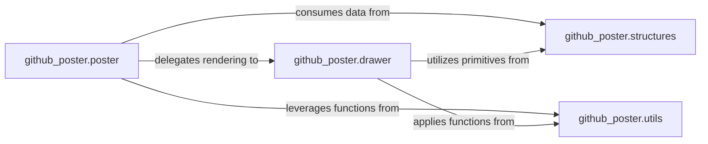

## Details

The `GitHub Calendar Renderer` subsystem is dedicated to generating SVG visualizations that mimic the GitHub contribution calendar, showcasing daily activity levels in a grid format.

### github_poster.poster
Acts as the primary orchestrator for initiating SVG generation. It manages the high-level rendering process, including layout, and delegates specific drawing tasks for the GitHub contribution calendar. This component embodies the "SVG Renderer/Generator" pattern's orchestration aspect.

**Related Classes/Methods**:

- <a href="https://github.com/yihong0618/GitHubPoster/blob/main/github_poster/poster.py" target="_blank" rel="noopener noreferrer">`github_poster.poster`</a>

### github_poster.drawer
Specializes in the detailed, low-level rendering of individual SVG elements, particularly the "day boxes" that form the calendar grid. It is responsible for applying styling, colors, and animations to these elements, directly contributing to the "SVG Renderer/Generator" functionality.

**Related Classes/Methods**:

- <a href="https://github.com/yihong0618/GitHubPoster/blob/main/github_poster/drawer.py" target="_blank" rel="noopener noreferrer">`github_poster.drawer`</a>

### github_poster.structures
Defines core data structures (e.g., `XY` for points, `Rect` for dimensions/ranges) essential for positioning, sizing, and managing geometric elements within the SVG output. This component provides the fundamental building blocks for any visual representation.

**Related Classes/Methods**:

- <a href="https://github.com/yihong0618/GitHubPoster/blob/main/github_poster/structures.py" target="_blank" rel="noopener noreferrer">`github_poster.structures`</a>

### github_poster.utils
Provides general helper functions that support the operations of the `poster` and `drawer` components. These include common tasks such as date manipulation, color conversions, or other general utilities required during the rendering process.

**Related Classes/Methods**:

- <a href="https://github.com/yihong0618/GitHubPoster/blob/main/github_poster/utils.py" target="_blank" rel="noopener noreferrer">`github_poster.utils`</a>

### [FAQ](https://github.com/CodeBoarding/GeneratedOnBoardings/tree/main?tab=readme-ov-file#faq)