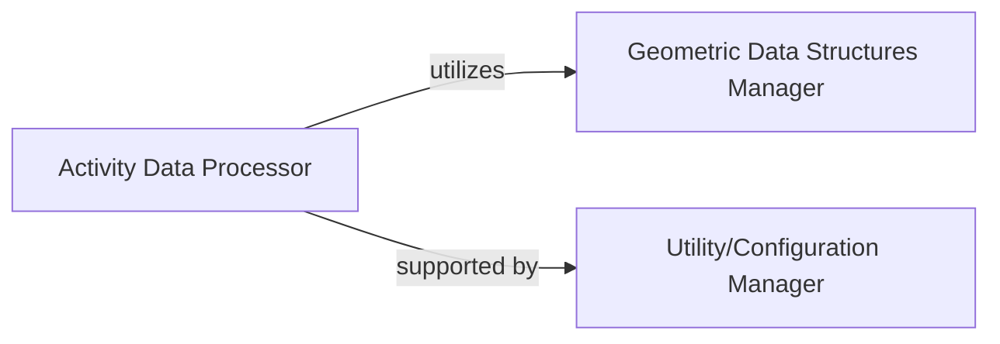

## Details

The `Poster Data Manager` subsystem is responsible for the core logic of aggregating, processing, and preparing normalized activity data for visualization, along with managing poster-specific configurations.

### Activity Data Processor
This component is the orchestrator for aggregating, processing, and performing statistical computations on raw activity data. It transforms the raw input into a structured format suitable for visualization, handling methods like `set_tracks` and `compute_track_statistics`. It is central to the data processing pipeline.

**Related Classes/Methods**:

- <a href="https://github.com/yihong0618/GitHubPoster/blob/main/github_poster/poster.py" target="_blank" rel="noopener noreferrer">`github_poster.poster:set_tracks`</a>
- <a href="https://github.com/yihong0618/GitHubPoster/blob/main/github_poster/poster.py" target="_blank" rel="noopener noreferrer">`github_poster.poster:compute_track_statistics`</a>

### Geometric Data Structures Manager
This component defines and manages fundamental geometric data structures, specifically `XY` for coordinates, and provides methods for their creation, manipulation, validation, and mathematical operations. It provides the essential building blocks for representing visual elements on the poster.

**Related Classes/Methods**:

- <a href="https://github.com/yihong0618/GitHubPoster/blob/main/github_poster/structures.py#L39-L68" target="_blank" rel="noopener noreferrer">`github_poster.structures.XY`:39-68</a>

### Utility/Configuration Manager
This component provides general utility functions that support various operations within the subsystem and potentially handles poster-specific configurations. It acts as a supporting layer for common tasks and settings.

**Related Classes/Methods**:

- <a href="https://github.com/yihong0618/GitHubPoster/blob/main/github_poster/utils.py" target="_blank" rel="noopener noreferrer">`github_poster.utils`</a>

### [FAQ](https://github.com/CodeBoarding/GeneratedOnBoardings/tree/main?tab=readme-ov-file#faq)