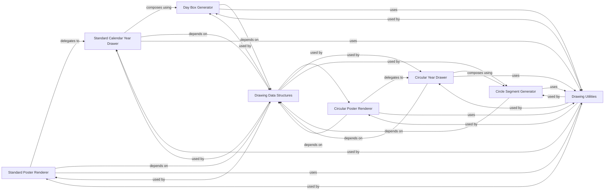

## Details

The SVG Drawing Engine subsystem is responsible for rendering various shapes, text, and elements onto an SVG canvas, serving as the foundational drawing layer for all specific poster renderers.

### Standard Poster Renderer
Orchestrates the generation of the standard GitHub-style contribution poster. It acts as the primary high-level renderer for this specific visualization type.

**Related Classes/Methods**:

- <a href="https://github.com/yihong0618/GitHubPoster/blob/main/github_poster/drawer.py#L234-L254" target="_blank" rel="noopener noreferrer">`github_poster.drawer.draw`:234-254</a>

### Circular Poster Renderer [[Expand]](./Circular_Poster_Renderer.md)
Orchestrates the generation of the circular contribution poster. It serves as another primary high-level renderer for a distinct visualization type.

**Related Classes/Methods**:

- <a href="https://github.com/yihong0618/GitHubPoster/blob/main/github_poster/circluar_drawer.py#L21-L36" target="_blank" rel="noopener noreferrer">`github_poster.circluar_drawer.draw`:21-36</a>

### Drawing Data Structures
Provides foundational data structures (e.g., XY for 2D points) and potentially geometric calculation utilities essential for all drawing operations. This is a core dependency for rendering.

**Related Classes/Methods**:

- <a href="https://github.com/yihong0618/GitHubPoster/blob/main/github_poster/structures.py" target="_blank" rel="noopener noreferrer">`github_poster.structures`</a>

### Drawing Utilities
Provides common utility functions (e.g., color handling, SVG attribute generation, general math helpers) that are reused across both standard and circular drawing logic to avoid duplication.

**Related Classes/Methods**:

- <a href="https://github.com/yihong0618/GitHubPoster/blob/main/github_poster/utils.py" target="_blank" rel="noopener noreferrer">`github_poster.utils`</a>

### Standard Calendar Year Drawer
Manages the rendering of all day boxes for a single calendar year within the standard poster. It's a mid-level drawing function, delegating to lower-level primitives.

**Related Classes/Methods**:

- <a href="https://github.com/yihong0618/GitHubPoster/blob/main/github_poster/drawer.py#L143-L232" target="_blank" rel="noopener noreferrer">`github_poster.drawer._draw_one_calendar`:143-232</a>

### Circular Year Drawer
Handles the drawing of a single year's data in the circular poster format. It's a mid-level drawing function for the circular visualization, delegating to lower-level primitives.

**Related Classes/Methods**:

- <a href="https://github.com/yihong0618/GitHubPoster/blob/main/github_poster/circluar_drawer.py#L38-L142" target="_blank" rel="noopener noreferrer">`github_poster.circluar_drawer._draw_year`:38-142</a>

### Day Box Generator
Generates individual day box SVG elements for the standard poster. This is a low-level primitive generator, responsible for creating the basic visual units.

**Related Classes/Methods**:

- <a href="https://github.com/yihong0618/GitHubPoster/blob/main/github_poster/drawer.py#L73-L96" target="_blank" rel="noopener noreferrer">`github_poster.drawer._gen_day_box`:73-96</a>

### Circle Segment Generator
Renders segments of the circular design. This is another low-level primitive generator, responsible for creating the basic visual units for the circular poster.

**Related Classes/Methods**:

- <a href="https://github.com/yihong0618/GitHubPoster/blob/main/github_poster/circluar_drawer.py#L154-L181" target="_blank" rel="noopener noreferrer">`github_poster.circluar_drawer._draw_circle_segment`:154-181</a>

### [FAQ](https://github.com/CodeBoarding/GeneratedOnBoardings/tree/main?tab=readme-ov-file#faq)