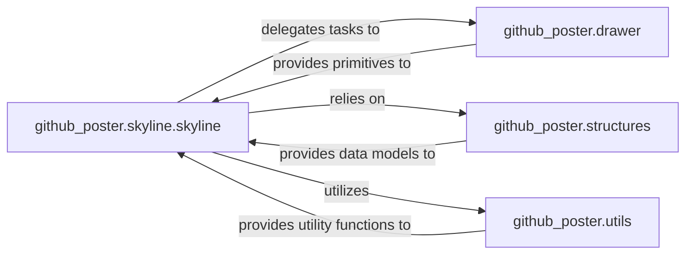

## Details

The `Skyline Renderer` subsystem is primarily defined by the following modules and their contained functionalities: `github_poster.skyline.skyline`, `github_poster.drawer`, `github_poster.structures`, and `github_poster.utils`.

### github_poster.skyline.skyline
This component serves as the primary orchestrator for generating the "skyline" style SVG visualizations. It handles data normalization, layout calculations, and coordinates the creation of all visual elements, embodying the "SVG Renderer/Generator" pattern.

**Related Classes/Methods**:

- <a href="https://github.com/yihong0618/GitHubPoster/blob/main/github_poster/skyline/skyline.py" target="_blank" rel="noopener noreferrer">`github_poster.skyline.skyline`</a>

### github_poster.drawer
This component provides the fundamental, low-level drawing primitives required for rendering specific visual elements within the SVG output. It abstracts direct SVG manipulation, applying visual attributes like colors and animations, acting as a rendering engine sub-component.

**Related Classes/Methods**:

- <a href="https://github.com/yihong0618/GitHubPoster/blob/main/github_poster/drawer.py" target="_blank" rel="noopener noreferrer">`github_poster.drawer`</a>

### github_poster.structures
This component defines and manages core geometric data types (e.g., `XY` for 2D points, `Rect` for bounding boxes). It provides essential operations for spatial calculations, including extending bounds, calculating dimensions, and checking containment, forming the foundational data model for layout.

**Related Classes/Methods**:

- <a href="https://github.com/yihong0618/GitHubPoster/blob/main/github_poster/structures.py" target="_blank" rel="noopener noreferrer">`github_poster.structures`</a>

### github_poster.utils
This component contains general-purpose helper functions that support various aspects of the application, including data processing and date handling. While not directly involved in SVG rendering, it provides auxiliary functionalities crucial for the overall operation of the `Skyline Renderer`.

**Related Classes/Methods**:

- <a href="https://github.com/yihong0618/GitHubPoster/blob/main/github_poster/utils.py" target="_blank" rel="noopener noreferrer">`github_poster.utils`</a>

### [FAQ](https://github.com/CodeBoarding/GeneratedOnBoardings/tree/main?tab=readme-ov-file#faq)