```mermaid
graph LR
    CLI_Orchestrator["CLI Orchestrator"]
    Data_Source_Adapters["Data Source Adapters"]
    Poster_Data_Manager["Poster Data Manager"]
    SVG_Drawing_Engine["SVG Drawing Engine"]
    GitHub_Calendar_Renderer["GitHub Calendar Renderer"]
    Circular_Poster_Renderer["Circular Poster Renderer"]
    Skyline_Renderer["Skyline Renderer"]
    CLI_Orchestrator -- "initiates data requests to" --> Data_Source_Adapters
    Data_Source_Adapters -- "provides normalized data to" --> Poster_Data_Manager
    Poster_Data_Manager -- "supplies processed data to" --> GitHub_Calendar_Renderer
    Poster_Data_Manager -- "supplies processed data to" --> Circular_Poster_Renderer
    Poster_Data_Manager -- "supplies processed data to" --> Skyline_Renderer
    GitHub_Calendar_Renderer -- "utilizes" --> SVG_Drawing_Engine
    Circular_Poster_Renderer -- "utilizes" --> SVG_Drawing_Engine
    Skyline_Renderer -- "utilizes" --> SVG_Drawing_Engine
    GitHub_Calendar_Renderer -- "returns SVG output to" --> CLI_Orchestrator
    Circular_Poster_Renderer -- "returns SVG output to" --> CLI_Orchestrator
    Skyline_Renderer -- "returns SVG output to" --> CLI_Orchestrator
    click CLI_Orchestrator href "https://github.com/CodeBoarding/GeneratedOnBoardings/blob/main/GitHubPoster/CLI_Orchestrator.md" "Details"
    click Data_Source_Adapters href "https://github.com/CodeBoarding/GeneratedOnBoardings/blob/main/GitHubPoster/Data_Source_Adapters.md" "Details"
    click Poster_Data_Manager href "https://github.com/CodeBoarding/GeneratedOnBoardings/blob/main/GitHubPoster/Poster_Data_Manager.md" "Details"
    click SVG_Drawing_Engine href "https://github.com/CodeBoarding/GeneratedOnBoardings/blob/main/GitHubPoster/SVG_Drawing_Engine.md" "Details"
    click GitHub_Calendar_Renderer href "https://github.com/CodeBoarding/GeneratedOnBoardings/blob/main/GitHubPoster/GitHub_Calendar_Renderer.md" "Details"
    click Circular_Poster_Renderer href "https://github.com/CodeBoarding/GeneratedOnBoardings/blob/main/GitHubPoster/Circular_Poster_Renderer.md" "Details"
    click Skyline_Renderer href "https://github.com/CodeBoarding/GeneratedOnBoardings/blob/main/GitHubPoster/Skyline_Renderer.md" "Details"
```

## Details

The GitHubPoster architecture is structured around a clear data processing pipeline, driven by a CLI Orchestrator. It begins with Data Source Adapters fetching and normalizing diverse activity data. This data is then centralized and prepared by the Poster Data Manager. Finally, specialized Visualization Renderers (GitHub Calendar, Circular, Skyline) consume this processed data, leveraging a common SVG Drawing Engine to produce distinct visual outputs. This modular design ensures clear separation of concerns, facilitating extensibility for new data sources or visualization types, and provides a robust framework for generating personalized activity posters.

### CLI Orchestrator [[Expand]](./CLI_Orchestrator.md)
The application's entry point, responsible for argument parsing, configuration, and coordinating the overall data flow from loading to rendering and output.

**Related Classes/Methods**:

- <a href="https://github.com/yihong0618/GitHubPoster/blob/main/github_poster/cli.py" target="_blank" rel="noopener noreferrer">`github_poster.cli:main`</a>
- <a href="https://github.com/yihong0618/GitHubPoster/blob/main/github_poster/cli.py" target="_blank" rel="noopener noreferrer">`github_poster.cli:run`</a>

### Data Source Adapters [[Expand]](./Data_Source_Adapters.md)
A collection of modules that connect to external services (e.g., GitHub, Strava) to fetch raw activity data and normalize it into a consistent internal format.

**Related Classes/Methods**:

- <a href="https://github.com/yihong0618/GitHubPoster/blob/main/github_poster/loader/base_loader.py" target="_blank" rel="noopener noreferrer">`github_poster.loader.base_loader`</a>
- <a href="https://github.com/yihong0618/GitHubPoster/blob/main/github_poster/loader/github_loader.py" target="_blank" rel="noopener noreferrer">`github_poster.loader.github_loader`</a>
- <a href="https://github.com/yihong0618/GitHubPoster/blob/main/github_poster/loader/strava_loader.py" target="_blank" rel="noopener noreferrer">`github_poster.loader.strava_loader`</a>

### Poster Data Manager [[Expand]](./Poster_Data_Manager.md)
Central component for aggregating, processing, and preparing normalized activity data for various visualization types, managing poster-specific configurations.

**Related Classes/Methods**:

- <a href="https://github.com/yihong0618/GitHubPoster/blob/main/github_poster/poster.py" target="_blank" rel="noopener noreferrer">`github_poster.poster:set_tracks`</a>
- <a href="https://github.com/yihong0618/GitHubPoster/blob/main/github_poster/structures.py" target="_blank" rel="noopener noreferrer">`github_poster.structures`</a>
- <a href="https://github.com/yihong0618/GitHubPoster/blob/main/github_poster/utils.py" target="_blank" rel="noopener noreferrer">`github_poster.utils`</a>

### SVG Drawing Engine [[Expand]](./SVG_Drawing_Engine.md)
Provides the foundational capabilities for drawing various shapes, text, and elements onto an SVG canvas, used by all specific renderers.

**Related Classes/Methods**:

- <a href="https://github.com/yihong0618/GitHubPoster/blob/main/github_poster/drawer.py" target="_blank" rel="noopener noreferrer">`github_poster.drawer:draw`</a>
- <a href="https://github.com/yihong0618/GitHubPoster/blob/main/github_poster/circluar_drawer.py" target="_blank" rel="noopener noreferrer">`github_poster.circluar_drawer:draw`</a>
- <a href="https://github.com/yihong0618/GitHubPoster/blob/main/github_poster/structures.py" target="_blank" rel="noopener noreferrer">`github_poster.structures`</a>
- <a href="https://github.com/yihong0618/GitHubPoster/blob/main/github_poster/utils.py" target="_blank" rel="noopener noreferrer">`github_poster.utils`</a>

### GitHub Calendar Renderer [[Expand]](./GitHub_Calendar_Renderer.md)
Specializes in generating SVG visualizations resembling the GitHub contribution calendar, displaying daily activity levels in a grid format.

**Related Classes/Methods**:

- <a href="https://github.com/yihong0618/GitHubPoster/blob/main/github_poster/poster.py" target="_blank" rel="noopener noreferrer">`github_poster.poster:_draw_github`</a>
- <a href="https://github.com/yihong0618/GitHubPoster/blob/main/github_poster/drawer.py" target="_blank" rel="noopener noreferrer">`github_poster.drawer`</a>
- <a href="https://github.com/yihong0618/GitHubPoster/blob/main/github_poster/structures.py" target="_blank" rel="noopener noreferrer">`github_poster.structures`</a>
- <a href="https://github.com/yihong0618/GitHubPoster/blob/main/github_poster/utils.py" target="_blank" rel="noopener noreferrer">`github_poster.utils`</a>

### Circular Poster Renderer [[Expand]](./Circular_Poster_Renderer.md)
Creates SVG visualizations in a circular format, ideal for annual or cyclical activity patterns, arranging data points radially.

**Related Classes/Methods**:

- <a href="https://github.com/yihong0618/GitHubPoster/blob/main/github_poster/poster.py" target="_blank" rel="noopener noreferrer">`github_poster.poster:_draw_circular`</a>
- <a href="https://github.com/yihong0618/GitHubPoster/blob/main/github_poster/circluar_drawer.py" target="_blank" rel="noopener noreferrer">`github_poster.circluar_drawer`</a>
- <a href="https://github.com/yihong0618/GitHubPoster/blob/main/github_poster/structures.py" target="_blank" rel="noopener noreferrer">`github_poster.structures`</a>
- <a href="https://github.com/yihong0618/GitHubPoster/blob/main/github_poster/utils.py" target="_blank" rel="noopener noreferrer">`github_poster.utils`</a>

### Skyline Renderer [[Expand]](./Skyline_Renderer.md)
Generates SVG visualizations in a "skyline" style, representing activity data as varying heights of bars or shapes with optional text overlays.

**Related Classes/Methods**:

- <a href="https://github.com/yihong0618/GitHubPoster/blob/main/github_poster/skyline/skyline.py" target="_blank" rel="noopener noreferrer">`github_poster.skyline.skyline:make_skyline`</a>
- <a href="https://github.com/yihong0618/GitHubPoster/blob/main/github_poster/drawer.py" target="_blank" rel="noopener noreferrer">`github_poster.drawer`</a>
- <a href="https://github.com/yihong0618/GitHubPoster/blob/main/github_poster/structures.py" target="_blank" rel="noopener noreferrer">`github_poster.structures`</a>
- <a href="https://github.com/yihong0618/GitHubPoster/blob/main/github_poster/utils.py" target="_blank" rel="noopener noreferrer">`github_poster.utils`</a>

### [FAQ](https://github.com/CodeBoarding/GeneratedOnBoardings/tree/main?tab=readme-ov-file#faq)