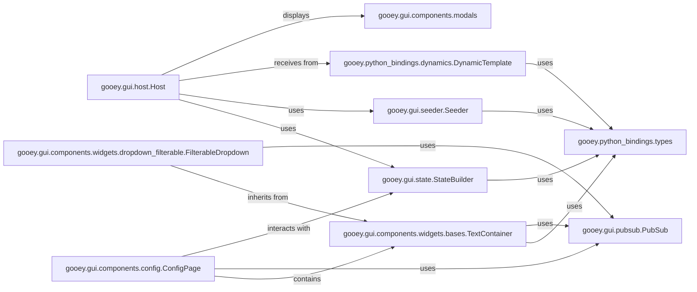

## Component Details

This subsystem is the heart of Gooey's user interface, responsible for rendering all visual elements, handling user input, and facilitating real-time communication between the GUI and the underlying Python script. It enables dynamic form validation, interactive widget behavior, and post-execution callbacks, creating a responsive and user-friendly experience.

### gooey.gui.components.config.ConfigPage
This component is the primary container for user input within the Gooey GUI. It dynamically renders and manages all the interactive widgets (e.g., text fields, checkboxes, dropdowns) that represent the argparse arguments. It's responsible for collecting user input, performing client-side validation, and displaying validation errors, forming the core of the user's interaction with the application's configuration.

**Related Classes/Methods**:

- <a href="https://github.com/chriskiehl/Gooey/blob/master/gooey/gui/components/config.py#L13-L243" target="_blank" rel="noopener noreferrer">`gooey.gui.components.config.ConfigPage` (13:243)</a>

### gooey.gui.components.widgets.bases.TextContainer
As a foundational base class, TextContainer provides common functionalities and a standardized layout for all text-based input widgets (e.g., TextField, Password, TextArea). It handles the display of labels, help text, and validation errors, manages the widget's UI state, and retrieves its value. This promotes consistency and reusability across various input types.

**Related Classes/Methods**:

- <a href="https://github.com/chriskiehl/Gooey/blob/master/gooey/gui/components/widgets/bases.py#L47-L240" target="_blank" rel="noopener noreferrer">`gooey.gui.components.widgets.bases.TextContainer` (47:240)</a>

### gooey.gui.host.Host
This component acts as the central communication bridge between the Gooey GUI (frontend) and the user's Python script (backend). It dispatches various GUI states and commands, enabling dynamic interactions such as real-time form validation, live updates to widget options, and post-execution callbacks. It orchestrates the asynchronous flow of data and control signals.

**Related Classes/Methods**:

- <a href="https://github.com/chriskiehl/Gooey/blob/master/gooey/gui/host.py#L1-L1" target="_blank" rel="noopener noreferrer">`gooey.gui.host.Host` (1:1)</a>

### gooey.gui.state.StateBuilder
This component is responsible for constructing and serializing data structures that represent the current state of the GUI. This includes collecting values from all widgets, their validation status, and other relevant UI information. It prepares this comprehensive state data for transmission to the Python backend, ensuring accurate and timely updates for dynamic behaviors.

**Related Classes/Methods**:

- <a href="https://github.com/chriskiehl/Gooey/blob/master/gooey/gui/state.py#L1-L1" target="_blank" rel="noopener noreferrer">`gooey.gui.state.StateBuilder` (1:1)</a>

### gooey.gui.seeder.Seeder
The Seeder component handles the actual transmission of data and commands between the GUI and the Python application. It manages the serialization and deserialization processes, ensuring that complex GUI state information and dynamic updates are reliably exchanged. It acts as the concrete implementation of the communication channel.

**Related Classes/Methods**:

- <a href="https://github.com/chriskiehl/Gooey/blob/master/gooey/gui/seeder.py#L1-L1" target="_blank" rel="noopener noreferrer">`gooey.gui.seeder.Seeder` (1:1)</a>

### gooey.python_bindings.dynamics.DynamicTemplate
This component contains the core logic for dynamically modifying Python's argparse module at runtime. It allows Gooey to intercept and augment the argument parsing process, enabling advanced features like dynamic form validation (where input in one field affects others), conditional visibility of widgets, and comprehensive error collection from the backend.

**Related Classes/Methods**:

- <a href="https://github.com/chriskiehl/Gooey/blob/master/gooey/python_bindings/dynamics.py#L1-L1" target="_blank" rel="noopener noreferrer">`gooey.python_bindings.dynamics.DynamicTemplate` (1:1)</a>

### gooey.python_bindings.types
This module defines the various data types and structures (e.g., FormField, FieldValue, WidgetState) used for consistent communication and representation of GUI elements and their states between the Gooey frontend and the Python backend. It acts as the essential data contract, ensuring that both sides understand the format of exchanged information.

**Related Classes/Methods**:

- <a href="https://github.com/chriskiehl/Gooey/blob/master/gooey/python_bindings/types.py#L1-L1" target="_blank" rel="noopener noreferrer">`gooey.python_bindings.types` (1:1)</a>

### gooey.gui.pubsub.PubSub
This component implements a simplified publish-subscribe messaging pattern within the GUI. It enables loose coupling between different GUI components, allowing them to communicate and react to events without direct dependencies. Components can subscribe to specific message types and publish messages to notify others about state changes or user interactions, facilitating flexible and scalable UI interactions.

**Related Classes/Methods**:

- <a href="https://github.com/chriskiehl/Gooey/blob/master/gooey/gui/pubsub.py#L6-L33" target="_blank" rel="noopener noreferrer">`gooey.gui.pubsub.PubSub` (6:33)</a>

### gooey.gui.components.modals
This module provides a standardized way to display various modal dialogs to the user, such as alerts, confirmations, and informational messages. It ensures consistent user feedback and interaction for critical events, guiding the user through different application states or informing them of important outcomes.

**Related Classes/Methods**:

- <a href="https://github.com/chriskiehl/Gooey/blob/master/gooey/gui/components/modals.py#L1-L1" target="_blank" rel="noopener noreferrer">`gooey.gui.components.modals` (1:1)</a>

### gooey.gui.components.widgets.dropdown_filterable.FilterableDropdown
This specialized dropdown widget enhances user interaction by providing advanced filtering capabilities. It allows users to efficiently search and select from a large list of options, significantly improving usability for complex or extensive input choices. Its dynamic filtering behavior is a prime example of interactive UI.

**Related Classes/Methods**:

- <a href="https://github.com/chriskiehl/Gooey/blob/master/gooey/gui/components/widgets/dropdown_filterable.py#L16-L221" target="_blank" rel="noopener noreferrer">`gooey.gui.components.widgets.dropdown_filterable.FilterableDropdown` (16:221)</a>

### [FAQ](https://github.com/CodeBoarding/GeneratedOnBoardings/tree/main?tab=readme-ov-file#faq)