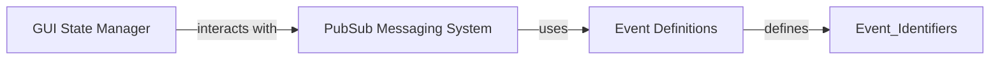

## Component Details

One paragraph explaining the functionality which is represented by this graph. What the main flow is and what is its purpose.

### GUI State Manager
This component is the central repository for all dynamic data within the Gooey GUI. It maintains the current state of form inputs, UI elements, and application-wide progress. By centralizing state, it ensures data consistency across the application and provides a single source of truth for GUI-related information.

**Related Classes/Methods**:

- <a href="https://github.com/chriskiehl/Gooey/blob/master/gooey/gui/state.py#L43-L55" target="_blank" rel="noopener noreferrer">`gooey.gui.state.GooeyState` (43:55)</a>

### PubSub Messaging System
This component implements a lightweight publish-subscribe mechanism, enabling decoupled, asynchronous communication between different parts of the Gooey application. It allows components to "publish" messages (events) and other components to "subscribe" to specific message types, receiving notifications without direct dependencies on the publishers.

**Related Classes/Methods**:

- <a href="https://github.com/chriskiehl/Gooey/blob/master/gooey/gui/pubsub.py#L6-L33" target="_blank" rel="noopener noreferrer">`gooey.gui.pubsub.PubSub` (6:33)</a>
- <a href="https://github.com/chriskiehl/Gooey/blob/master/gooey/gui/pubsub.py#L14-L15" target="_blank" rel="noopener noreferrer">`gooey.gui.pubsub.PubSub:subscribe` (14:15)</a>
- <a href="https://github.com/chriskiehl/Gooey/blob/master/gooey/gui/pubsub.py#L17-L19" target="_blank" rel="noopener noreferrer">`gooey.gui.pubsub.PubSub:send_message` (17:19)</a>

### Event Definitions
This component serves as a registry for application-wide event identifiers. It defines constants that represent various events occurring within the Gooey application, such as window actions, panel changes, and console updates. These identifiers are used in conjunction with the `PubSub Messaging System` to facilitate communication between different parts of the GUI.

**Related Classes/Methods**:

- <a href="https://github.com/chriskiehl/Gooey/blob/master/gooey/gui/events.py#L0-L0" target="_blank" rel="noopener noreferrer">`gooey.gui.events` (0:0)</a>

### [FAQ](https://github.com/CodeBoarding/GeneratedOnBoardings/tree/main?tab=readme-ov-file#faq)