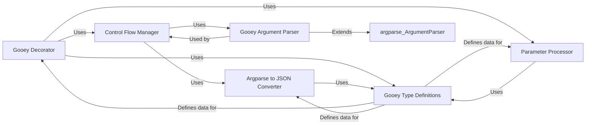

## Component Details

This component serves as the initial interface between the user's Python script and the Gooey framework. It intercepts the script's execution, processes `argparse` definitions, and converts them into a structured, GUI-friendly format. Crucially, it determines the application's operational mode—whether to launch the full Gooey GUI, perform specific validation tasks, or bypass Gooey entirely and execute the original script.

### Gooey Decorator
This is the primary entry point for integrating Gooey with a user's Python script. It acts as a function decorator (`@Gooey`) that wraps the user's `main` function. Its core responsibility is to intercept the script's execution, inject Gooey's custom `ArgumentParser` behavior, and delegate control to the appropriate handler based on the application's operational mode. It also processes the configuration parameters supplied by the user.

**Related Classes/Methods**:

- `Gooey Decorator` (1:1)

### Control Flow Manager
This component is responsible for analyzing the current execution environment (e.g., command-line arguments) and the Gooey configuration to decide how the application should proceed. It determines whether to launch the full Gooey GUI, perform specific validation tasks, or allow the original script to execute without Gooey's intervention. It then dispatches control to the appropriate internal handler.

**Related Classes/Methods**:

- `Control Flow Manager` (1:1)

### Argparse to JSON Converter
This component's crucial role is to translate the standard Python `argparse` argument definitions (from the user's script) into a structured JSON format. This JSON representation is then consumed by the Gooey GUI to dynamically render the user interface elements (text fields, checkboxes, dropdowns, etc.) that correspond to the script's command-line arguments.

**Related Classes/Methods**:

- `Argparse to JSON Converter` (1:1)

### Gooey Type Definitions
This component defines the fundamental data structures and type annotations used throughout the Gooey framework, particularly within the `python_bindings` module. Key definitions include `GooeyParams`, which encapsulates all the configuration options for the Gooey GUI, ensuring consistency and clarity across the system.

**Related Classes/Methods**:

- `Gooey Type Definitions` (1:1)

### Parameter Processor
This component is responsible for taking the keyword arguments supplied to the `@Gooey` decorator by the user and processing them. This includes validating the input, applying default values where necessary, and transforming them into the internal `GooeyParams` data structure, which then guides the behavior and appearance of the Gooey GUI.

**Related Classes/Methods**:

- `Parameter Processor` (1:1)

### Gooey Argument Parser
This component extends or modifies the standard `argparse.ArgumentParser` to integrate seamlessly with Gooey's requirements. It might include custom parsing logic, argument validation, or mechanisms to extract metadata from the `argparse` definitions that are necessary for generating the GUI. It ensures that the arguments defined by the user's script are correctly interpreted by Gooey.

**Related Classes/Methods**:

- `Gooey Argument Parser` (1:1)

### [FAQ](https://github.com/CodeBoarding/GeneratedOnBoardings/tree/main?tab=readme-ov-file#faq)