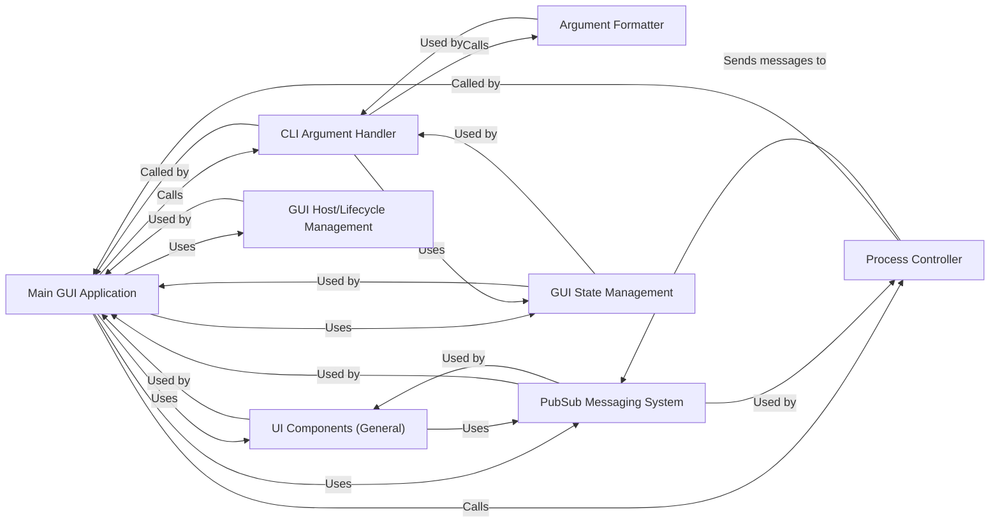

## Component Details

The Main GUI Application subsystem is the core of the Gooey graphical user interface. It acts as the central orchestrator, managing the primary application window, handling high-level UI layout, and navigating between different screens (e.g., form configuration, console output, success/error messages). It coordinates user interactions and the overall application lifecycle within the GUI.

### Main GUI Application
The central orchestrator of the Gooey graphical user interface. It manages the primary application window, handles high-level UI layout, and navigates between different screens (e.g., form configuration, console output, success/error messages). It acts as the main coordinator for user interactions and the overall application lifecycle within the GUI.

**Related Classes/Methods**:

- <a href="https://github.com/chriskiehl/Gooey/blob/master/gooey/gui/containers/application.py#L1-L1" target="_blank" rel="noopener noreferrer">`gooey.gui.containers.application` (1:1)</a>
- <a href="https://github.com/chriskiehl/Gooey/blob/master/gooey/gui/application/application.py#L1-L1" target="_blank" rel="noopener noreferrer">`gooey.gui.application.application` (1:1)</a>

### UI Components (General)
This component encompasses all the individual graphical user interface elements and their foundational structures used to build the Gooey application's visual layout. This includes widgets (text fields, buttons, dropdowns, choosers), dialogs, and layout managers.

**Related Classes/Methods**:

- `gooey.gui.components` (1:1)
- <a href="https://github.com/chriskiehl/Gooey/blob/master/gooey/gui/components/config.py#L1-L1" target="_blank" rel="noopener noreferrer">`gooey.gui.components.config` (1:1)</a>
- <a href="https://github.com/chriskiehl/Gooey/blob/master/gooey/gui/components/console.py#L1-L1" target="_blank" rel="noopener noreferrer">`gooey.gui.components.console` (1:1)</a>
- <a href="https://github.com/chriskiehl/Gooey/blob/master/gooey/gui/components/dialogs.py#L1-L1" target="_blank" rel="noopener noreferrer">`gooey.gui.components.dialogs` (1:1)</a>
- <a href="https://github.com/chriskiehl/Gooey/blob/master/gooey/gui/components/footer.py#L1-L1" target="_blank" rel="noopener noreferrer">`gooey.gui.components.footer` (1:1)</a>
- <a href="https://github.com/chriskiehl/Gooey/blob/master/gooey/gui/components/header.py#L1-L1" target="_blank" rel="noopener noreferrer">`gooey.gui.components.header` (1:1)</a>
- `gooey.gui.components.layouts` (1:1)
- <a href="https://github.com/chriskiehl/Gooey/blob/master/gooey/gui/components/menubar.py#L1-L1" target="_blank" rel="noopener noreferrer">`gooey.gui.components.menubar` (1:1)</a>
- <a href="https://github.com/chriskiehl/Gooey/blob/master/gooey/gui/components/modals.py#L1-L1" target="_blank" rel="noopener noreferrer">`gooey.gui.components.modals` (1:1)</a>
- <a href="https://github.com/chriskiehl/Gooey/blob/master/gooey/gui/components/mouse.py#L1-L1" target="_blank" rel="noopener noreferrer">`gooey.gui.components.mouse` (1:1)</a>
- `gooey.gui.components.options` (1:1)
- <a href="https://github.com/chriskiehl/Gooey/blob/master/gooey/gui/components/sidebar.py#L1-L1" target="_blank" rel="noopener noreferrer">`gooey.gui.components.sidebar` (1:1)</a>
- <a href="https://github.com/chriskiehl/Gooey/blob/master/gooey/gui/components/tabbar.py#L1-L1" target="_blank" rel="noopener noreferrer">`gooey.gui.components.tabbar` (1:1)</a>
- `gooey.gui.components.widgets` (1:1)

### CLI Argument Handler
This component is responsible for taking user input from the Gooey GUI, validating it against defined rules, and constructing the final command-line string that will be executed. It acts as the bridge between the GUI and the underlying script's expected arguments.

**Related Classes/Methods**:

- <a href="https://github.com/chriskiehl/Gooey/blob/master/gooey/gui/cli.py#L1-L1" target="_blank" rel="noopener noreferrer">`gooey.gui.cli` (1:1)</a>

### Argument Formatter
This component contains a collection of functions dedicated to formatting different types of arguments (e.g., checkboxes, text areas, file choosers, dropdowns) into a suitable string format for command-line execution or display. It ensures that values are correctly quoted and represented.

**Related Classes/Methods**:

- <a href="https://github.com/chriskiehl/Gooey/blob/master/gooey/gui/formatters.py#L1-L1" target="_blank" rel="noopener noreferrer">`gooey.gui.formatters` (1:1)</a>

### Process Controller
This component is the execution engine of Gooey. It's responsible for spawning the user's Python script as a subprocess, monitoring its execution, capturing its standard output and error streams, and extracting progress information from the output. It also handles stopping the process.

**Related Classes/Methods**:

- <a href="https://github.com/chriskiehl/Gooey/blob/master/gooey/gui/processor.py#L1-L1" target="_blank" rel="noopener noreferrer">`gooey.gui.processor` (1:1)</a>

### PubSub Messaging System
This component provides a publish-subscribe mechanism for inter-component communication within the GUI. It allows different parts of the application to send and receive messages without direct coupling, facilitating a more modular design.

**Related Classes/Methods**:

- <a href="https://github.com/chriskiehl/Gooey/blob/master/gooey/gui/pubsub.py#L1-L1" target="_blank" rel="noopener noreferrer">`gooey.gui.pubsub` (1:1)</a>

### GUI State Management
This component is responsible for maintaining and providing access to the current state of the Gooey GUI application, including user configurations, application settings, and runtime data. It ensures consistency across different parts of the UI.

**Related Classes/Methods**:

- <a href="https://github.com/chriskiehl/Gooey/blob/master/gooey/gui/state.py#L1-L1" target="_blank" rel="noopener noreferrer">`gooey.gui.state` (1:1)</a>

### GUI Host/Lifecycle Management
This component handles the initial setup, bootstrapping, and overall lifecycle management of the Gooey GUI application. It prepares the environment, initializes the main application window, and manages the application's execution flow.

**Related Classes/Methods**:

- <a href="https://github.com/chriskiehl/Gooey/blob/master/gooey/gui/host.py#L1-L1" target="_blank" rel="noopener noreferrer">`gooey.gui.host` (1:1)</a>
- <a href="https://github.com/chriskiehl/Gooey/blob/master/gooey/gui/bootstrap.py#L1-L1" target="_blank" rel="noopener noreferrer">`gooey.gui.bootstrap` (1:1)</a>

### [FAQ](https://github.com/CodeBoarding/GeneratedOnBoardings/tree/main?tab=readme-ov-file#faq)