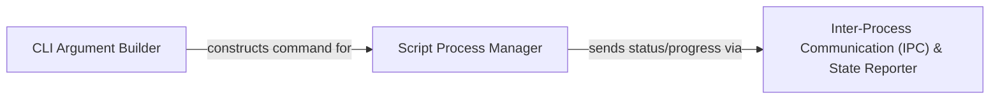

## Component Details

This component is responsible for executing the user's original Python script as a separate subprocess. It constructs the precise command-line arguments based on the values provided through the Gooey GUI, initiates and monitors the script's execution, captures its standard output and error streams, and reports real-time status and progress back to the GUI.

### CLI Argument Builder
This component is responsible for constructing the complete command-line argument string that will be used to execute the user's script. It takes the validated input from the GUI and formats it into a shell-executable string, ensuring proper quoting and handling of various argument types. This is fundamental because it translates the user's GUI selections into a runnable command for the underlying script.

**Related Classes/Methods**:

- <a href="https://github.com/chriskiehl/Gooey/blob/master/gooey/gui/cli.py#L42-L52" target="_blank" rel="noopener noreferrer">`gooey.gui.cli.formValidationCmd` (42:52)</a>
- <a href="https://github.com/chriskiehl/Gooey/blob/master/gooey/gui/cli.py#L73-L91" target="_blank" rel="noopener noreferrer">`gooey.gui.cli.cmdOrPlaceholderOrNone` (73:91)</a>
- <a href="https://github.com/chriskiehl/Gooey/blob/master/gooey/gui/formatters.py#L53-L77" target="_blank" rel="noopener noreferrer">`gooey.gui.formatters.formatArgument` (53:77)</a>

### Script Process Manager
This component is the heart of the execution engine. It's responsible for spawning the user's Python script as a separate subprocess, actively monitoring its lifecycle, capturing its standard output (stdout) and standard error (stderr) streams, and extracting progress information. It also provides mechanisms to stop the running process. This component is fundamental as it directly manages the execution of the user's script, isolating it from the GUI and providing control over its lifecycle.

**Related Classes/Methods**:

- <a href="https://github.com/chriskiehl/Gooey/blob/master/gooey/gui/processor.py#L25-L161" target="_blank" rel="noopener noreferrer">`gooey.gui.processor.ProcessController` (25:161)</a>
- <a href="https://github.com/chriskiehl/Gooey/blob/master/gooey/gui/processor.py#L113-L128" target="_blank" rel="noopener noreferrer">`gooey.gui.processor.ProcessController._forward_stdout` (113:128)</a>

### Inter-Process Communication (IPC) & State Reporter
This component facilitates communication between the `Script Process Manager` and other parts of the Gooey GUI, particularly for reporting real-time status, progress updates, and completion/error notifications. It leverages a publish-subscribe mechanism to decouple the process execution from the GUI's display logic. This component is fundamental for providing a responsive user experience by asynchronously updating the GUI with the script's progress and output without blocking the main thread.

**Related Classes/Methods**:

- <a href="https://github.com/chriskiehl/Gooey/blob/master/gooey/gui/pubsub.py#L6-L33" target="_blank" rel="noopener noreferrer">`gooey.gui.pubsub.PubSub` (6:33)</a>
- <a href="https://github.com/chriskiehl/Gooey/blob/master/gooey/gui/pubsub.py#L17-L19" target="_blank" rel="noopener noreferrer">`gooey.gui.pubsub.PubSub.send_message` (17:19)</a>

### [FAQ](https://github.com/CodeBoarding/GeneratedOnBoardings/tree/main?tab=readme-ov-file#faq)