```mermaid
graph LR
    Gooey_Entry_Point_Configuration["Gooey Entry Point & Configuration"]
    Main_GUI_Application["Main GUI Application"]
    GUI_State_Event_Management["GUI State & Event Management"]
    User_Script_Execution_Engine["User Script Execution Engine"]
    Dynamic_Interaction_UI_Components["Dynamic Interaction & UI Components"]
    Gooey_Entry_Point_Configuration -- "Initiates" --> Main_GUI_Application
    Gooey_Entry_Point_Configuration -- "Provides data to" --> GUI_State_Event_Management
    Main_GUI_Application -- "Manages" --> Dynamic_Interaction_UI_Components
    Main_GUI_Application -- "Observes/Updates" --> GUI_State_Event_Management
    Main_GUI_Application -- "Initiates execution via" --> User_Script_Execution_Engine
    GUI_State_Event_Management -- "Manages state for" --> Dynamic_Interaction_UI_Components
    GUI_State_Event_Management -- "Receives updates from" --> User_Script_Execution_Engine
    GUI_State_Event_Management -- "Receives updates from" --> Dynamic_Interaction_UI_Components
    User_Script_Execution_Engine -- "Sends status updates to" --> GUI_State_Event_Management
    User_Script_Execution_Engine -- "Receives command from" --> Main_GUI_Application
    Dynamic_Interaction_UI_Components -- "Updates" --> GUI_State_Event_Management
    Dynamic_Interaction_UI_Components -- "Provides input to" --> User_Script_Execution_Engine
    Dynamic_Interaction_UI_Components -- "Interacts with" --> Main_GUI_Application
    click Gooey_Entry_Point_Configuration href "https://github.com/CodeBoarding/GeneratedOnBoardings/blob/main//Gooey/Gooey_Entry_Point_Configuration.md" "Details"
    click Main_GUI_Application href "https://github.com/CodeBoarding/GeneratedOnBoardings/blob/main//Gooey/Main_GUI_Application.md" "Details"
    click GUI_State_Event_Management href "https://github.com/CodeBoarding/GeneratedOnBoardings/blob/main//Gooey/GUI_State_Event_Management.md" "Details"
    click User_Script_Execution_Engine href "https://github.com/CodeBoarding/GeneratedOnBoardings/blob/main//Gooey/User_Script_Execution_Engine.md" "Details"
    click Dynamic_Interaction_UI_Components href "https://github.com/CodeBoarding/GeneratedOnBoardings/blob/main//Gooey/Dynamic_Interaction_UI_Components.md" "Details"
```

## Component Details

Final architecture analysis for Gooey, focusing on its fundamental components and their interactions.

### Gooey Entry Point & Configuration
This component serves as the initial interface between the user's Python script and the Gooey framework. It intercepts the script's execution, processes `argparse` definitions, and converts them into a structured, GUI-friendly format. Crucially, it determines the application's operational mode—whether to launch the full Gooey GUI, perform specific validation tasks, or bypass Gooey entirely and execute the original script.

**Related Classes/Methods**:

- <a href="https://github.com/chriskiehl/Gooey/blob/master/gooey/python_bindings/gooey_decorator.py#L0-L0" target="_blank" rel="noopener noreferrer">`gooey.python_bindings.gooey_decorator` (0:0)</a>
- <a href="https://github.com/chriskiehl/Gooey/blob/master/gooey/python_bindings/control.py#L0-L0" target="_blank" rel="noopener noreferrer">`gooey.python_bindings.control` (0:0)</a>
- <a href="https://github.com/chriskiehl/Gooey/blob/master/gooey/python_bindings/argparse_to_json.py#L0-L0" target="_blank" rel="noopener noreferrer">`gooey.python_bindings.argparse_to_json` (0:0)</a>

### Main GUI Application
This is the central orchestrator of the Gooey graphical user interface. It manages the primary application window, handles high-level UI layout, and navigates between different screens (e.g., form configuration, console output, success/error messages). It acts as the main coordinator for user interactions and the overall application lifecycle within the GUI.

**Related Classes/Methods**:

- <a href="https://github.com/chriskiehl/Gooey/blob/master/gooey/gui/containers/application.py#L0-L0" target="_blank" rel="noopener noreferrer">`gooey.gui.containers.application` (0:0)</a>
- <a href="https://github.com/chriskiehl/Gooey/blob/master/gooey/gui/application/application.py#L0-L0" target="_blank" rel="noopener noreferrer">`gooey.gui.application.application` (0:0)</a>

### GUI State & Event Management
This component is the backbone for managing the dynamic state of the entire Gooey GUI. It maintains form data, UI element states, and application progress. It also incorporates a central Publish-Subscribe (PubSub) mechanism, enabling decoupled communication between various GUI components and the backend, ensuring consistency and responsiveness across the application.

**Related Classes/Methods**:

- <a href="https://github.com/chriskiehl/Gooey/blob/master/gooey/gui/state.py#L0-L0" target="_blank" rel="noopener noreferrer">`gooey.gui.state` (0:0)</a>
- <a href="https://github.com/chriskiehl/Gooey/blob/master/gooey/gui/pubsub.py#L0-L0" target="_blank" rel="noopener noreferrer">`gooey.gui.pubsub` (0:0)</a>

### User Script Execution Engine
This component is responsible for executing the user's original Python script as a separate subprocess. It constructs the precise command-line arguments based on the values provided through the Gooey GUI, initiates and monitors the script's execution, captures its standard output and error streams, and reports real-time status and progress back to the GUI.

**Related Classes/Methods**:

- <a href="https://github.com/chriskiehl/Gooey/blob/master/gooey/gui/processor.py#L0-L0" target="_blank" rel="noopener noreferrer">`gooey.gui.processor` (0:0)</a>
- <a href="https://github.com/chriskiehl/Gooey/blob/master/gooey/gui/cli.py#L0-L0" target="_blank" rel="noopener noreferrer">`gooey.gui.cli` (0:0)</a>
- <a href="https://github.com/chriskiehl/Gooey/blob/master/gooey/gui/formatters.py#L0-L0" target="_blank" rel="noopener noreferrer">`gooey.gui.formatters` (0:0)</a>

### Dynamic Interaction & UI Components
This comprehensive component encompasses all the visual and interactive elements that constitute the Gooey GUI, ranging from high-level containers (like configuration panels and console displays) to individual input widgets (e.g., text fields, checkboxes, file choosers). It also facilitates asynchronous communication with the user's script for dynamic form validation and post-execution callbacks, enabling a highly interactive and responsive user experience.

**Related Classes/Methods**:

- <a href="https://github.com/chriskiehl/Gooey/blob/master/gooey/gui/components/config.py#L0-L0" target="_blank" rel="noopener noreferrer">`gooey.gui.components.config` (0:0)</a>
- <a href="https://github.com/chriskiehl/Gooey/blob/master/gooey/gui/components/console.py#L0-L0" target="_blank" rel="noopener noreferrer">`gooey.gui.components.console` (0:0)</a>
- <a href="https://github.com/chriskiehl/Gooey/blob/master/gooey/gui/components/footer.py#L0-L0" target="_blank" rel="noopener noreferrer">`gooey.gui.components.footer` (0:0)</a>
- <a href="https://github.com/chriskiehl/Gooey/blob/master/gooey/gui/components/header.py#L0-L0" target="_blank" rel="noopener noreferrer">`gooey.gui.components.header` (0:0)</a>
- <a href="https://github.com/chriskiehl/Gooey/blob/master/gooey/gui/components/menubar.py#L0-L0" target="_blank" rel="noopener noreferrer">`gooey.gui.components.menubar` (0:0)</a>
- <a href="https://github.com/chriskiehl/Gooey/blob/master/gooey/gui/components/modals.py#L0-L0" target="_blank" rel="noopener noreferrer">`gooey.gui.components.modals` (0:0)</a>
- <a href="https://github.com/chriskiehl/Gooey/blob/master/gooey/gui/components/sidebar.py#L0-L0" target="_blank" rel="noopener noreferrer">`gooey.gui.components.sidebar` (0:0)</a>
- <a href="https://github.com/chriskiehl/Gooey/blob/master/gooey/gui/components/tabbar.py#L0-L0" target="_blank" rel="noopener noreferrer">`gooey.gui.components.tabbar` (0:0)</a>
- <a href="https://github.com/chriskiehl/Gooey/blob/master/gooey/gui/components/widgets/bases.py#L0-L0" target="_blank" rel="noopener noreferrer">`gooey.gui.components.widgets.bases` (0:0)</a>
- <a href="https://github.com/chriskiehl/Gooey/blob/master/gooey/gui/components/widgets/checkbox.py#L0-L0" target="_blank" rel="noopener noreferrer">`gooey.gui.components.widgets.checkbox` (0:0)</a>
- <a href="https://github.com/chriskiehl/Gooey/blob/master/gooey/gui/components/widgets/choosers.py#L0-L0" target="_blank" rel="noopener noreferrer">`gooey.gui.components.widgets.choosers` (0:0)</a>
- <a href="https://github.com/chriskiehl/Gooey/blob/master/gooey/gui/components/widgets/dropdown.py#L0-L0" target="_blank" rel="noopener noreferrer">`gooey.gui.components.widgets.dropdown` (0:0)</a>
- <a href="https://github.com/chriskiehl/Gooey/blob/master/gooey/gui/host.py#L0-L0" target="_blank" rel="noopener noreferrer">`gooey.gui.host` (0:0)</a>
- <a href="https://github.com/chriskiehl/Gooey/blob/master/gooey/gui/seeder.py#L0-L0" target="_blank" rel="noopener noreferrer">`gooey.gui.seeder` (0:0)</a>
- <a href="https://github.com/chriskiehl/Gooey/blob/master/gooey/python_bindings/dynamics.py#L0-L0" target="_blank" rel="noopener noreferrer">`gooey.python_bindings.dynamics` (0:0)</a>
- <a href="https://github.com/chriskiehl/Gooey/blob/master/gooey/python_bindings/types.py#L0-L0" target="_blank" rel="noopener noreferrer">`gooey.python_bindings.types` (0:0)</a>

### [FAQ](https://github.com/CodeBoarding/GeneratedOnBoardings/tree/main?tab=readme-ov-file#faq)