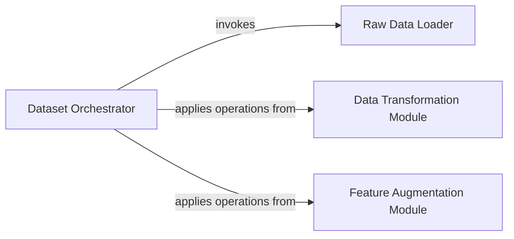

## Details

The `Data Pipeline` subsystem is a critical part of the GraphGym project, embodying the "Pipeline Architecture" and "Data Management" patterns. It is responsible for the end-to-end processing of graph datasets, from initial loading to preparing them for model consumption, ensuring data integrity and suitability for various GNN tasks. It encompasses all functionalities related to data loading, transformation, and feature engineering. Its core components are primarily located within `graphgym/loader.py`, `graphgym/models/transform.py`, and `graphgym/models/feature_augment.py`. It acts as the preparatory layer before data is fed into the model training and evaluation stages.

### Dataset Orchestrator
This component serves as the central control point for the entire data preparation pipeline. It orchestrates the sequential steps of data loading, initial filtering, and the application of various transformations and feature augmentations, ensuring data is correctly prepared for model consumption. It embodies the "Pipeline Flow" pattern by coordinating the data processing stages.

**Related Classes/Methods**:

- <a href="https://github.com/snap-stanford/GraphGym/blob/master/graphgym/loader.py#L217-L270" target="_blank" rel="noopener noreferrer">`create_dataset`:217-270</a>

### Raw Data Loader
Responsible for the initial acquisition and parsing of raw graph datasets from diverse formats (e.g., PyTorch Geometric, NetworkX). It serves as the primary interface to external data sources, abstracting away data format specifics. This aligns with the "Data Management" aspect of an ML toolkit by providing robust data ingestion capabilities.

**Related Classes/Methods**:

- <a href="https://github.com/snap-stanford/GraphGym/blob/master/graphgym/loader.py#L93-L124" target="_blank" rel="noopener noreferrer">`load_dataset`:93-124</a>
- <a href="https://github.com/snap-stanford/GraphGym/blob/master/graphgym/loader.py#L23-L73" target="_blank" rel="noopener noreferrer">`load_pyg`:23-73</a>
- <a href="https://github.com/snap-stanford/GraphGym/blob/master/graphgym/loader.py#L76-L90" target="_blank" rel="noopener noreferrer">`load_nx`:76-90</a>

### Data Transformation Module
Provides a collection of generic and task-specific functions to modify the structure or content of the dataset. These transformations (e.g., negative sampling for link prediction, creating link labels) are applied as part of the `create_dataset` pipeline, ensuring data conforms to specific model or task requirements. This is a core "Data Management" utility, enabling data manipulation.

**Related Classes/Methods**:

- <a href="https://github.com/snap-stanford/GraphGym/blob/master/graphgym/models/transform.py#L113-L132" target="_blank" rel="noopener noreferrer">`neg_sampling_transform`:113-132</a>
- <a href="https://github.com/snap-stanford/GraphGym/blob/master/graphgym/models/transform.py#L94-L110" target="_blank" rel="noopener noreferrer">`create_link_label`:94-110</a>

### Feature Augmentation Module
Manages and applies techniques to enhance, modify, or generate new features within the dataset, ensuring they are in a suitable format for model input. This module also supports the "Plugin/Extension Architecture" by providing mechanisms (`register_feature_fun`) for users to register and integrate custom augmentation functions, thereby extending the toolkit's capabilities.

**Related Classes/Methods**:

- <a href="https://github.com/snap-stanford/GraphGym/blob/master/graphgym/register.py#L129-L130" target="_blank" rel="noopener noreferrer">`augment`:129-130</a>
- <a href="https://github.com/snap-stanford/GraphGym/blob/master/graphgym/models/feature_augment.py#L134-L135" target="_blank" rel="noopener noreferrer">`register_feature_fun`:134-135</a>
- <a href="https://github.com/snap-stanford/GraphGym/blob/master/graphgym/models/feature_augment.py#L255-L314" target="_blank" rel="noopener noreferrer">`_augment_feature`:255-314</a>
- <a href="https://github.com/snap-stanford/GraphGym/blob/master/graphgym/models/feature_augment.py#L137-L149" target="_blank" rel="noopener noreferrer">`_bin_features`:137-149</a>
- <a href="https://github.com/snap-stanford/GraphGym/blob/master/graphgym/models/feature_augment.py#L25-L39" target="_blank" rel="noopener noreferrer">`_replace_label`:25-39</a>

### [FAQ](https://github.com/CodeBoarding/GeneratedOnBoardings/tree/main?tab=readme-ov-file#faq)