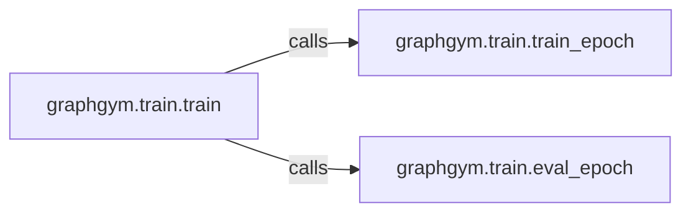

## Details

The Experiment Orchestrator subsystem, primarily encapsulated in graphgym/train.py, manages the lifecycle of machine learning experiments from initialization through iterative training and evaluation.

### graphgym.train.train
This function serves as the central control flow for the entire experiment. It initializes the training process, manages the iterative execution of training and evaluation epochs, and oversees the overall experiment lifecycle. It embodies the "Experiment Orchestrator" pattern by coordinating various stages of the ML pipeline.

**Related Classes/Methods**:

- <a href="https://github.com/snap-stanford/GraphGym/blob/master/graphgym/train.py#L49-L84" target="_blank" rel="noopener noreferrer">`graphgym.train.train`:49-84</a>

### graphgym.train.train_epoch
This function encapsulates the logic for a single training iteration (epoch). It is responsible for iterating through data batches, performing forward passes, calculating loss, backpropagating gradients, and updating model parameters. This represents a distinct "Task Execution" stage within the overall pipeline.

**Related Classes/Methods**:

- <a href="https://github.com/snap-stanford/GraphGym/blob/master/graphgym/train.py#L12-L29" target="_blank" rel="noopener noreferrer">`graphgym.train.train_epoch`:12-29</a>

### graphgym.train.eval_epoch
This function encapsulates the logic for a single evaluation iteration (epoch). It involves iterating through validation/test data, performing forward passes, and computing relevant evaluation metrics without updating model parameters. This also represents a distinct "Task Execution" stage within the pipeline.

**Related Classes/Methods**:

- <a href="https://github.com/snap-stanford/GraphGym/blob/master/graphgym/train.py#L32-L46" target="_blank" rel="noopener noreferrer">`graphgym.train.eval_epoch`:32-46</a>

### [FAQ](https://github.com/CodeBoarding/GeneratedOnBoardings/tree/main?tab=readme-ov-file#faq)