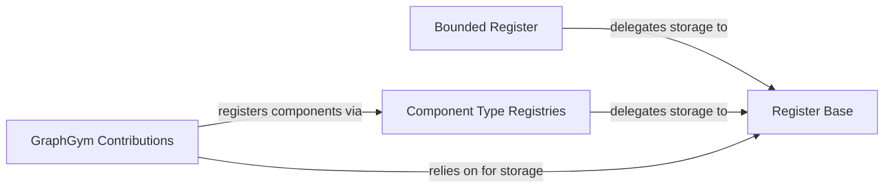

## Details

The Extensibility & Plugin Manager subsystem in GraphGym provides a robust framework for integrating custom components, leveraging a centralized registration mechanism for various elements of a Graph Neural Network pipeline. This design ensures the framework remains highly modular and easily extensible.

### Register Base
Acts as the foundational, centralized registry. It maintains a mapping of component names to their implementations, providing the fundamental storage and retrieval mechanism for all registered components within the framework.

**Related Classes/Methods**:

- <a href="https://github.com/snap-stanford/GraphGym/blob/master/graphgym/register.py" target="_blank" rel="noopener noreferrer">`graphgym.register`</a>

### Bounded Register
Provides a more controlled and potentially validated registration process. It wraps the Register Base to enforce specific behaviors, such as preventing overwrites or ensuring naming conventions, thereby enhancing the robustness of the plugin system.

**Related Classes/Methods**:

- <a href="https://github.com/snap-stanford/GraphGym/blob/master/graphgym/register.py" target="_blank" rel="noopener noreferrer">`graphgym.register`</a>

### Component Type Registries
These are specialized API endpoints designed for registering specific types of GNN components (e.g., graph convolution layers, complete network architectures, activation functions, pooling methods, etc.). They abstract the underlying registration mechanism, providing a clear interface for developers to extend the framework with new functionalities.

**Related Classes/Methods**:

- <a href="https://github.com/snap-stanford/GraphGym/blob/master/graphgym/register.py" target="_blank" rel="noopener noreferrer">`graphgym.register`</a>

### GraphGym Contributions
This component serves as the primary location for housing concrete implementations of various GNN components (e.g., custom layers, networks, activation functions). It demonstrates how these components are integrated into the GraphGym framework by utilizing the Component Type Registries to make them available for use in experiments.

**Related Classes/Methods**:

- <a href="https://github.com/snap-stanford/GraphGym/blob/master/graphgym/contrib/__init__.py" target="_blank" rel="noopener noreferrer">`graphgym.contrib`</a>

### [FAQ](https://github.com/CodeBoarding/GeneratedOnBoardings/tree/main?tab=readme-ov-file#faq)