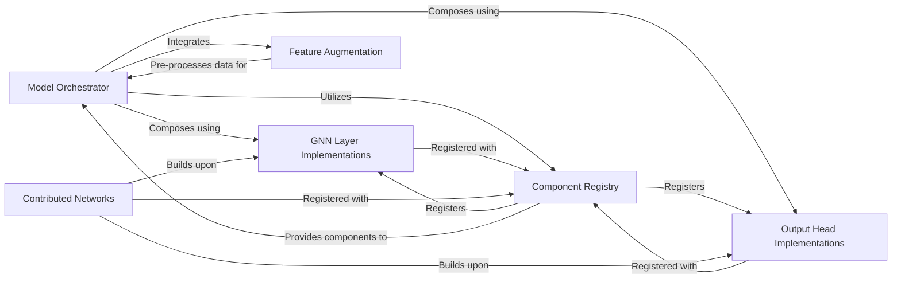

## Details

The GraphGym framework's core architecture is centered around a modular and configurable approach to Graph Neural Network (GNN) model construction. The `Model Orchestrator` acts as the central assembly unit, dynamically building GNNs by integrating various components. It leverages the `Component Registry` to discover and retrieve `GNN Layer Implementations` for graph convolutions, `Output Head Implementations` for task-specific predictions, and `Feature Augmentation` for preparing input data. This design allows for flexible experimentation, enabling users to easily combine and swap different GNN building blocks. Additionally, `Contributed Networks` provide pre-defined GNN architectures, showcasing how these modular components can be combined to form complete models. This interconnected system facilitates rapid prototyping and exploration of diverse GNN configurations.

### Model Orchestrator
Dynamically constructs the complete Graph Neural Network architecture based on configuration. It integrates various GNN layers, feature encoders, and prediction heads to define the overall flow of data through the GNN. This component is central to enabling the configuration-driven and modular nature of the framework.

**Related Classes/Methods**:

- <a href="https://github.com/snap-stanford/GraphGym/blob/master/graphgym/models/gnn.py" target="_blank" rel="noopener noreferrer">`graphgym.models.gnn`</a>
- <a href="https://github.com/snap-stanford/GraphGym/blob/master/graphgym/models/gnn_pyg.py" target="_blank" rel="noopener noreferrer">`graphgym.models.gnn_pyg`</a>

### GNN Layer Implementations
Provides a diverse collection of fundamental GNN layer types (e.g., graph convolutions, message passing operations) that serve as the building blocks for constructing GNN models. This component supports both core and custom layer types.

**Related Classes/Methods**:

- <a href="https://github.com/snap-stanford/GraphGym/blob/master/graphgym/models/layer.py" target="_blank" rel="noopener noreferrer">`graphgym.models.layer`</a>
- <a href="https://github.com/snap-stanford/GraphGym/blob/master/graphgym/models/layer_pyg.py" target="_blank" rel="noopener noreferrer">`graphgym.models.layer_pyg`</a>
- <a href="https://github.com/snap-stanford/GraphGym/blob/master/graphgym/contrib/layer" target="_blank" rel="noopener noreferrer">`graphgym.contrib.layer`</a>

### Output Head Implementations
Defines the final output layers of a GNN, responsible for mapping the GNN's internal representations to specific task outputs (e.g., node classification, graph classification, link prediction). This component also supports custom output heads.

**Related Classes/Methods**:

- <a href="https://github.com/snap-stanford/GraphGym/blob/master/graphgym/models/head.py" target="_blank" rel="noopener noreferrer">`graphgym.models.head`</a>
- <a href="https://github.com/snap-stanford/GraphGym/blob/master/graphgym/models/head_pyg.py" target="_blank" rel="noopener noreferrer">`graphgym.models.head_pyg`</a>
- <a href="https://github.com/snap-stanford/GraphGym/blob/master/graphgym/contrib/head" target="_blank" rel="noopener noreferrer">`graphgym.contrib.head`</a>

### Feature Augmentation
Handles the pre-processing and transformation of input features (e.g., node attributes, edge attributes) before they are fed into the GNN model, ensuring data is in the correct format for model consumption.

**Related Classes/Methods**:

- <a href="https://github.com/snap-stanford/GraphGym/blob/master/graphgym/models/feature_augment.py" target="_blank" rel="noopener noreferrer">`graphgym.models.feature_augment`</a>

### Component Registry
Provides a centralized mechanism to register, discover, and retrieve various GNN components (such as layers, heads, and networks). This is critical for the framework's extensibility and dynamic model construction based on configuration.

**Related Classes/Methods**:

- <a href="https://github.com/snap-stanford/GraphGym/blob/master/graphgym/register.py" target="_blank" rel="noopener noreferrer">`graphgym.register`</a>

### Contributed Networks
Offers example or specialized full GNN network architectures, demonstrating how various layers and heads can be combined to form complete models. These pre-built networks serve as templates or advanced starting points.

**Related Classes/Methods**:

- <a href="https://github.com/snap-stanford/GraphGym/blob/master/graphgym/contrib/network" target="_blank" rel="noopener noreferrer">`graphgym.contrib.network`</a>

### [FAQ](https://github.com/CodeBoarding/GeneratedOnBoardings/tree/main?tab=readme-ov-file#faq)