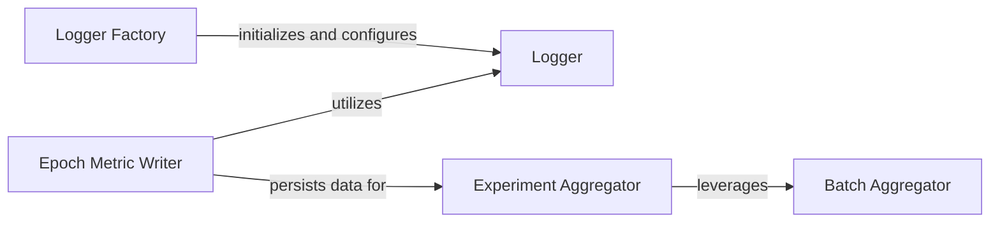

## Details

The GraphGym logging and aggregation subsystem is designed to efficiently capture, store, and analyze experimental metrics. The Logger Factory initializes and configures the Logger, which is central to collecting real-time performance data during training and evaluation. At the end of each epoch, the Epoch Metric Writer finalizes these metrics, utilizing the Logger to gather the aggregated data and then persisting this information to disk, typically as JSON files. Post-experiment, the Experiment Aggregator reads these persisted metric files from multiple runs, consolidating and analyzing them to provide a comprehensive overview of performance. This aggregation process is supported by the Batch Aggregator, which handles granular metric computations. This architecture ensures a clear separation between real-time data collection, epoch-end persistence, and post-experiment analysis, facilitating robust and reproducible research.

### Logger
The core component for real-time metric collection and logging during experiment execution (training and evaluation epochs). It acts as the central interface for recording various performance indicators and manages the state of collected metrics.

**Related Classes/Methods**:

- <a href="https://github.com/snap-stanford/GraphGym/blob/master/graphgym/logger.py#L34-L217" target="_blank" rel="noopener noreferrer">`graphgym.logger.Logger`:34-217</a>

### Logger Factory
A factory function responsible for initializing and configuring Logger instances. Its role is to set up the appropriate logging mechanisms based on the specific task or configuration, ensuring the Logger is ready for use.

**Related Classes/Methods**:

- <a href="https://github.com/snap-stanford/GraphGym/blob/master/graphgym/logger.py#L232-L243" target="_blank" rel="noopener noreferrer">`graphgym.logger.create_logger`:232-243</a>

### Epoch Metric Writer
This component orchestrates the finalization and writing of aggregated metrics at the end of each epoch. It interacts with the Logger to dispatch and record the collected data, persisting it to storage (e.g., JSON files), and also manages the resetting of the logger's state for subsequent epochs.

**Related Classes/Methods**:

- <a href="https://github.com/snap-stanford/GraphGym/blob/master/graphgym/logger.py#L163-L213" target="_blank" rel="noopener noreferrer">`graphgym.logger.write_epoch`:163-213</a>

### Experiment Aggregator
The primary component for post-experiment aggregation and analysis. It consolidates results across multiple experimental runs by reading persisted data (e.g., JSON files) from individual runs, handling variations like different data splits or random seeds to provide a comprehensive overview of performance. This is crucial for reproducibility and drawing conclusions from experiments.

**Related Classes/Methods**:

- <a href="https://github.com/snap-stanford/GraphGym/blob/master/graphgym/utils/agg_runs.py#L74-L154" target="_blank" rel="noopener noreferrer">`graphgym.utils.agg_runs.agg_runs`:74-154</a>

### Batch Aggregator
A utility function that performs granular aggregation of metrics, typically within a single batch or a specific subset of results. It serves as a building block for larger aggregation processes, utilized by the Experiment Aggregator.

**Related Classes/Methods**:

- <a href="https://github.com/snap-stanford/GraphGym/blob/master/graphgym/utils/agg_runs.py#L157-L247" target="_blank" rel="noopener noreferrer">`graphgym.utils.agg_runs.agg_batch`:157-247</a>

### [FAQ](https://github.com/CodeBoarding/GeneratedOnBoardings/tree/main?tab=readme-ov-file#faq)