```mermaid
graph LR
    Configuration_Manager["Configuration Manager"]
    Data_Pipeline["Data Pipeline"]
    Model_Builder["Model Builder"]
    Experiment_Orchestrator["Experiment Orchestrator"]
    Results_Logging_System["Results & Logging System"]
    Extensibility_Plugin_Manager["Extensibility & Plugin Manager"]
    Checkpointing_System["Checkpointing System"]
    Configuration_Manager -- "provides configurations to" --> Data_Pipeline
    Configuration_Manager -- "supplies parameters to" --> Model_Builder
    Configuration_Manager -- "passes parameters to" --> Experiment_Orchestrator
    Configuration_Manager -- "defines configurations for" --> Results_Logging_System
    Data_Pipeline -- "delivers data loaders to" --> Experiment_Orchestrator
    Model_Builder -- "supplies model to" --> Experiment_Orchestrator
    Experiment_Orchestrator -- "sends metrics to" --> Results_Logging_System
    Experiment_Orchestrator -- "triggers saving/loading in" --> Checkpointing_System
    Checkpointing_System -- "saves/loads for" --> Experiment_Orchestrator
    Extensibility_Plugin_Manager -- "enables integration in" --> Model_Builder
    Extensibility_Plugin_Manager -- "enables integration in" --> Data_Pipeline
    Extensibility_Plugin_Manager -- "enables integration in" --> Experiment_Orchestrator
    click Configuration_Manager href "https://github.com/CodeBoarding/GeneratedOnBoardings/blob/main/GraphGym/Configuration_Manager.md" "Details"
    click Data_Pipeline href "https://github.com/CodeBoarding/GeneratedOnBoardings/blob/main/GraphGym/Data_Pipeline.md" "Details"
    click Model_Builder href "https://github.com/CodeBoarding/GeneratedOnBoardings/blob/main/GraphGym/Model_Builder.md" "Details"
    click Experiment_Orchestrator href "https://github.com/CodeBoarding/GeneratedOnBoardings/blob/main/GraphGym/Experiment_Orchestrator.md" "Details"
    click Results_Logging_System href "https://github.com/CodeBoarding/GeneratedOnBoardings/blob/main/GraphGym/Results_Logging_System.md" "Details"
    click Extensibility_Plugin_Manager href "https://github.com/CodeBoarding/GeneratedOnBoardings/blob/main/GraphGym/Extensibility_Plugin_Manager.md" "Details"
```

## Details

The GraphGym architecture is designed for systematic Graph Neural Network experimentation, centered around a `Configuration Manager` that dictates all experiment parameters. The `Data Pipeline` prepares and delivers data loaders to the `Experiment Orchestrator`, while the `Model Builder` dynamically constructs the GNN architecture based on configuration, supplying the model to the `Experiment Orchestrator`. The `Experiment Orchestrator` then orchestrates the training and evaluation loops, interacting with the `Results & Logging System` for metric collection and the `Checkpointing System` for state persistence. An `Extensibility & Plugin Manager` provides hooks for integrating custom components across the system.

### Configuration Manager [[Expand]](./Configuration_Manager.md)
Centralizes the definition, loading, and generation of all experiment parameters, ensuring reproducibility and systematic experimentation.

**Related Classes/Methods**:

- <a href="https://github.com/snap-stanford/GraphGym/blob/master/graphgym/config.py" target="_blank" rel="noopener noreferrer">`graphgym/config.py`</a>
- <a href="https://github.com/snap-stanford/GraphGym/blob/master/run/configs_gen.py" target="_blank" rel="noopener noreferrer">`run/configs_gen.py`</a>

### Data Pipeline [[Expand]](./Data_Pipeline.md)
Manages the entire data flow, from raw dataset loading and applying necessary transformations to preparing efficient data loaders for model consumption.

**Related Classes/Methods**:

- <a href="https://github.com/snap-stanford/GraphGym/blob/master/graphgym/loader.py" target="_blank" rel="noopener noreferrer">`graphgym/loader.py`</a>
- <a href="https://github.com/snap-stanford/GraphGym/blob/master/graphgym/models/transform.py" target="_blank" rel="noopener noreferrer">`graphgym/models/transform.py`</a>
- <a href="https://github.com/snap-stanford/GraphGym/blob/master/graphgym/models/feature_augment.py" target="_blank" rel="noopener noreferrer">`graphgym/models/feature_augment.py`</a>

### Model Builder [[Expand]](./Model_Builder.md)
Dynamically constructs the Graph Neural Network architecture based on configuration, integrating various GNN layers, feature encoders, and prediction heads.

**Related Classes/Methods**:

- <a href="https://github.com/snap-stanford/GraphGym/blob/master/graphgym/models/gnn.py" target="_blank" rel="noopener noreferrer">`graphgym/models/gnn.py`</a>
- <a href="https://github.com/snap-stanford/GraphGym/blob/master/graphgym/models/gnn_pyg.py" target="_blank" rel="noopener noreferrer">`graphgym/models/gnn_pyg.py`</a>
- <a href="https://github.com/snap-stanford/GraphGym/blob/master/graphgym/models/layer.py" target="_blank" rel="noopener noreferrer">`graphgym/models/layer.py`</a>
- <a href="https://github.com/snap-stanford/GraphGym/blob/master/graphgym/models/head.py" target="_blank" rel="noopener noreferrer">`graphgym/models/head.py`</a>

### Experiment Orchestrator [[Expand]](./Experiment_Orchestrator.md)
The core execution engine managing training and evaluation loops, orchestrating interactions between data, model, and logging systems.

**Related Classes/Methods**:

- <a href="https://github.com/snap-stanford/GraphGym/blob/master/graphgym/train.py" target="_blank" rel="noopener noreferrer">`graphgym/train.py`</a>

### Results & Logging System [[Expand]](./Results_Logging_System.md)
Collects, logs, and reports experiment metrics, progress, and final results, providing utilities for aggregation and analysis.

**Related Classes/Methods**:

- <a href="https://github.com/snap-stanford/GraphGym/blob/master/graphgym/logger.py" target="_blank" rel="noopener noreferrer">`graphgym/logger.py`</a>
- <a href="https://github.com/snap-stanford/GraphGym/blob/master/graphgym/utils/agg_runs.py" target="_blank" rel="noopener noreferrer">`graphgym/utils/agg_runs.py`</a>

### Extensibility & Plugin Manager [[Expand]](./Extensibility_Plugin_Manager.md)
Provides a flexible mechanism for users to register and integrate custom components (e.g., layers, networks, datasets, optimizers) into the framework.

**Related Classes/Methods**:

- <a href="https://github.com/snap-stanford/GraphGym/blob/master/graphgym/register.py" target="_blank" rel="noopener noreferrer">`graphgym/register.py`</a>
- <a href="https://github.com/snap-stanford/GraphGym/blob/master/graphgym/contrib/" target="_blank" rel="noopener noreferrer">`graphgym/contrib/`</a>

### Checkpointing System
Manages the persistence and restoration of model states, optimizer states, and training progress for resuming experiments or model deployment.

**Related Classes/Methods**:

- <a href="https://github.com/snap-stanford/GraphGym/blob/master/graphgym/checkpoint.py" target="_blank" rel="noopener noreferrer">`graphgym/checkpoint.py`</a>

### [FAQ](https://github.com/CodeBoarding/GeneratedOnBoardings/tree/main?tab=readme-ov-file#faq)