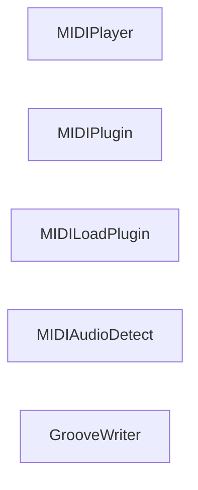

## Details

One paragraph explaining the functionality which is represented by this graph. What the main flow is and what is its purpose.

### MIDIPlayer
Handles MIDI playback functionality.

**Related Classes/Methods**:

- `MIDI.Player`

### MIDIPlugin
Manages MIDI plugin interactions.

**Related Classes/Methods**:

- `MIDI.Plugin`

### MIDILoadPlugin
Responsible for loading MIDI plugins.

**Related Classes/Methods**:

- `MIDI.LoadPlugin`

### MIDIAudioDetect
Detects audio capabilities.

**Related Classes/Methods**:

- `MIDI.AudioDetect`

### GrooveWriter
Plays a single note based on note settings.

**Related Classes/Methods**:

- `GrooveWriter.play_single_note_for_note_setting`

### [FAQ](https://github.com/CodeBoarding/GeneratedOnBoardings/tree/main?tab=readme-ov-file#faq)