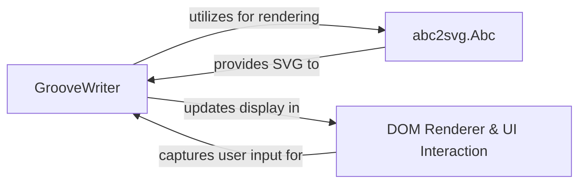

## Details

The `Groove Scribe` application's core subsystem is centered around the `GrooveWriter` component, which acts as the primary orchestrator for musical notation management and rendering. `GrooveWriter` processes and maintains the application's musical data, translating it into ABC notation format. For visual representation, it `utilizes for rendering` the `abc2svg.Abc` library, a dedicated engine that `provides SVG to` `GrooveWriter`. Once the SVG is received, `GrooveWriter` `updates display in` the `DOM Renderer & UI Interaction` component, which is responsible for presenting the sheet music to the user. Conversely, the `DOM Renderer & UI Interaction` `captures user input for` `GrooveWriter`, enabling interactive editing of the musical notation. This clear separation of concerns allows `GrooveWriter` to manage application state and logic, while `abc2svg.Abc` handles complex rendering, and the `DOM Renderer & UI Interaction` provides the visual interface.

### GrooveWriter
The core application logic component responsible for managing musical notation data, processing user input, and orchestrating the rendering of sheet music. It translates internal musical data structures into ABC notation strings, sends them to the `abc2svg.Abc` library for SVG generation, and then updates the `DOM Renderer & UI Interaction` to display the visual output. It also handles user interactions with the displayed notation.

**Related Classes/Methods**:

- `GrooveWriter`

### abc2svg.Abc
A third-party JavaScript library that acts as the dedicated rendering engine. Its primary responsibility is to parse ABC musical notation strings provided by `GrooveWriter` and convert them into Scalable Vector Graphics (SVG) representations of sheet music.

**Related Classes/Methods**:

- `abc2svg.Abc:Abc`
- `abc2svg.Abc:tosvg`

### DOM Renderer & UI Interaction
Represents the browser's Document Object Model (DOM) and the underlying mechanisms for rendering visual elements and capturing user input. It serves as the presentation layer, displaying the SVG output generated by `abc2svg.Abc` (via `GrooveWriter`) and relaying user interactions back to `GrooveWriter`.

**Related Classes/Methods**:

- `document.getElementById`
- `style`
- `event listeners`

### [FAQ](https://github.com/CodeBoarding/GeneratedOnBoardings/tree/main?tab=readme-ov-file#faq)