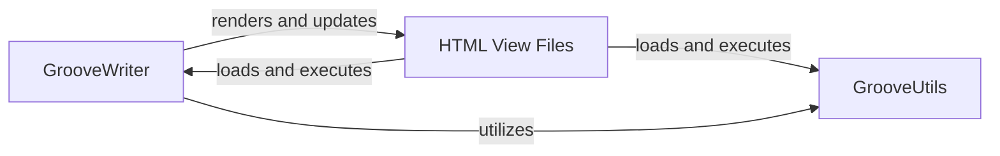

## Details

The GrooveScribe UI subsystem is a client-side application built with JavaScript and HTML. It uses HTML files for static view structures and JavaScript components like GrooveWriter and GrooveUtils for dynamic functionality. GrooveWriter controls the musical notation editor, while GrooveUtils provides shared utilities. The subsystem encompasses client-side presentation and interaction logic, specifically JavaScript files for UI functionality and HTML files for the user interface.

### GrooveWriter
This component serves as the core interactive controller for the musical notation display. It manages the visual rendering and interactive editing of musical grooves, including drawing notes, rhythms, and other musical elements on the screen. It is responsible for handling user interactions such as adding, deleting, or modifying groove components, effectively acting as the "View Controller" in an MVC-like pattern for the notation area.

**Related Classes/Methods**:

- `GrooveWriter`

### GrooveUtils
This component provides a collection of reusable utility functions that support the overall UI functionality. This includes common tasks such as data formatting, DOM manipulation, event handling, and other operations required by GrooveWriter and the various HTML View Files. It promotes code reuse and consistency across the UI layer.

**Related Classes/Methods**:

- `GrooveUtils`

### HTML View Files
These files define the static structure and initial content of various application pages or views. They serve as the containers for the dynamic content generated and managed by JavaScript components like GrooveWriter. They are the initial visual interface presented to the user, providing the basic layout and loading necessary scripts.

**Related Classes/Methods**:

- `GrooveDBCreateGroove.html`
- `GrooveEmbed.html`
- `GrooveMultiDisplay.html`
- `GScribeMusicImageOnly.html`
- `InterestingGrooves.html`
- `TestAllTimeSigs.html`
- `WeirdTimeSigsTest.html`

### [FAQ](https://github.com/CodeBoarding/GeneratedOnBoardings/tree/main?tab=readme-ov-file#faq)