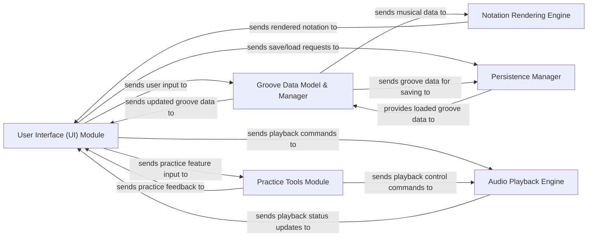

## Details

The GrooveScribe application is architected as a single-page web application with a strong client-side focus. The User Interface (UI) Module serves as the primary interaction point, driven by the GrooveWriter class which acts as a central controller. This controller directly manages the Groove Data Model & Manager, handling the creation, modification, and storage of musical grooves. It also orchestrates interactions with the Audio Playback Engine for sound generation and the Notation Rendering Engine for visual display of sheet music. The Persistence Manager handles data saving and loading, primarily through local storage, while the Practice Tools Module provides specialized functionalities for learning and practicing. This design promotes a cohesive and interactive user experience, with js/groove_writer.js being the pivotal file integrating most of the application's core logic.

### User Interface (UI) Module [[Expand]](./User_Interface_UI_Module.md)
The presentation layer, responsible for rendering all visual elements, handling user input, and displaying application state. It acts as the primary interface for user interaction.

**Related Classes/Methods**:

- `GrooveWriter`
- `GrooveUtils`
- `GrooveDBCreateGroove.html`
- `GrooveEmbed.html`
- `GrooveMultiDisplay.html`
- `GScribeMusicImageOnly.html`
- `InterestingGrooves.html`
- `TestAllTimeSigs.html`
- `WeirdTimeSigsTest.html`

### Groove Data Model & Manager [[Expand]](./Groove_Data_Model_Manager.md)
The core data layer, defining, storing, and managing the structure and content of musical "grooves." It acts as the central repository for all musical data, including notes, time signatures, and other musical properties.

**Related Classes/Methods**:

- `GrooveWriter`
- `GrooveUtils`
- `grooves`

### Audio Playback Engine [[Expand]](./Audio_Playback_Engine.md)
Manages all audio-related functionalities, including MIDI playback, sound synthesis, and synchronization with musical notation, leveraging the HTML5 Audio API and external MIDI.js library.

**Related Classes/Methods**:

- `GrooveWriter.play_single_note_for_note_setting`
- `MIDI`
- `MIDI`
- `MIDI`
- `MIDI`

### Notation Rendering Engine [[Expand]](./Notation_Rendering_Engine.md)
Dedicated to processing musical data from the Groove Data Model and rendering it into a visual sheet music format, primarily using SVG for scalable display.

**Related Classes/Methods**:

- `GrooveWriter.refresh_ABC`
- `GrooveWriter.displayNewSVG`
- `abc2svg-1.js`

### Persistence Manager
Handles the saving and loading of groove data to and from the client's local storage, ensuring data persistence across browser sessions.

**Related Classes/Methods**:

- `GrooveWriter.saveABCtoFile`
- `GrooveWriter.getQueryVariableFromURL`

### Practice Tools Module
Encapsulates the logic for practice-specific features, such as looping sections, adjusting playback speed, and metronome functions, designed to aid users in learning and practicing musical grooves.

**Related Classes/Methods**:

- `GrooveWriter.metronomeButtonClick`
- `GrooveWriter.changeDivision`
- `GrooveWriter.toggleAdvancedEdit`

### [FAQ](https://github.com/CodeBoarding/GeneratedOnBoardings/tree/main?tab=readme-ov-file#faq)