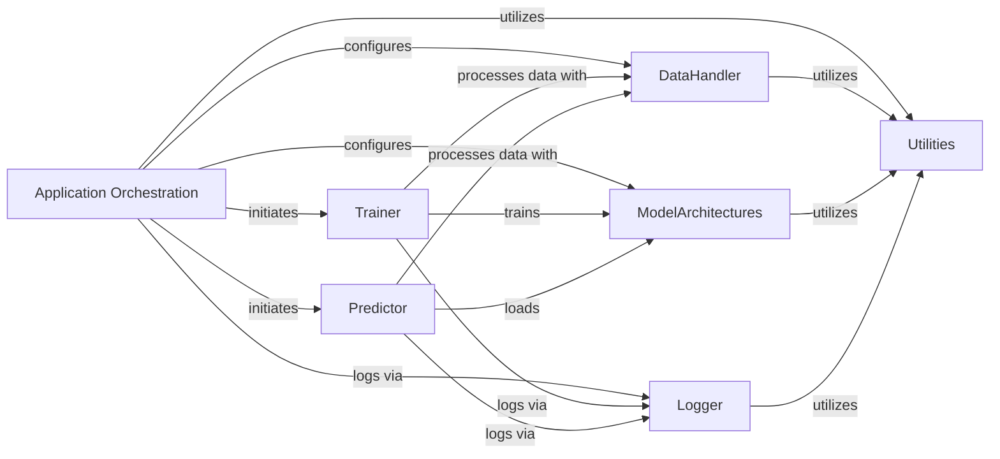

## Details

The `Application Orchestration` component serves as the central control point for the entire application, embodying the `Configuration-Driven Design` and `Command-Line Interface (CLI)` architectural patterns. It is fundamental because it acts as the application's entry point, interpreting user commands and configuration to initiate the correct workflow (training or prediction). Without this component, the application would lack a unified starting mechanism and the ability to adapt its behavior based on user input and predefined settings.

### Application Orchestration [[Expand]](./Application_Orchestration.md)
This component is the primary control point, responsible for parsing command-line arguments, loading and interpreting configuration settings from `models/config.yaml`, and orchestrating the execution of either training or prediction workflows. It acts as the central dispatcher, directing control to the appropriate core components based on user input and configuration.

**Related Classes/Methods**:

- `cli.HLAIIPred` (1:1)

### DataHandler
Essential for managing all data-related operations, from loading raw data to preparing it for model consumption. It ensures data consistency and efficiency, which is vital for deep learning applications.

**Related Classes/Methods**: _None_

### ModelArchitectures
Defines the core intellectual property of the project – the neural network structure. It's fundamental as it encapsulates the model's design, allowing for modularity and reusability.

**Related Classes/Methods**: _None_

### Trainer
Orchestrates the learning process, making it a core component for any deep learning development project. It manages the training loop, optimization, and model persistence.

**Related Classes/Methods**: _None_

### Predictor
Handles the application of the trained model to new data, delivering the primary output of the system. It's crucial for the practical utility of the developed model.

**Related Classes/Methods**: _None_

### Utilities
Provides common helper functions, promoting code reusability and reducing redundancy across the project. This is a foundational support component.

**Related Classes/Methods**: _None_

### Logger
Critical for monitoring, debugging, and understanding the application's behavior during execution. It provides essential feedback for development and operational purposes.

**Related Classes/Methods**: _None_

### [FAQ](https://github.com/CodeBoarding/GeneratedOnBoardings/tree/main?tab=readme-ov-file#faq)