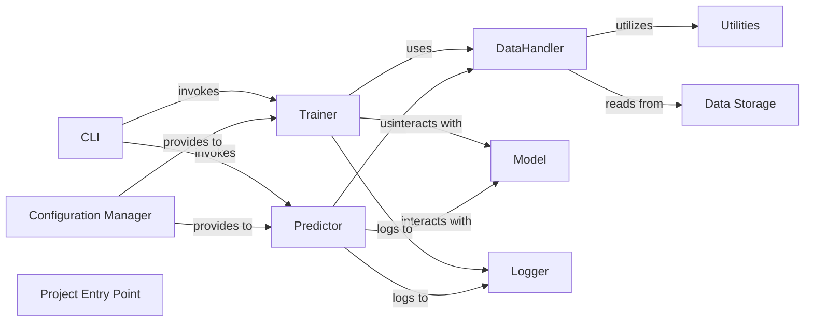

## Details

The Data Management component, specifically the DataHandler, is fundamental to this deep learning project due to its critical role in preparing biological sequence data for model consumption. In deep learning, the quality and format of input data directly impact model performance. The DataHandler ensures that raw, complex biological sequences are transformed into a clean, numerical, and batch-ready format, which is essential for efficient training and accurate predictions. This analysis focuses on the DataHandler and its interactions within the Deep Learning Model Development and Application pattern, detailing core functionalities and relationships among components for maintainability and scalability.

### DataHandler
Responsible for loading, preprocessing, and encoding raw biological sequence data (peptides, HLA alleles) into a numerical format suitable for deep learning models. It handles tokenization, padding, numerical encoding, and creates data loaders for efficient batching during training and inference.

**Related Classes/Methods**:

- <a href="https://github.com/pfizer-opensource/HLAIIPred/blob/main/hlapred/dataset.py#L1-L1" target="_blank" rel="noopener noreferrer">`hlapred.dataset` (1:1)</a>
- <a href="https://github.com/pfizer-opensource/HLAIIPred/blob/main/hlapred/utils.py#L39-L75" target="_blank" rel="noopener noreferrer">`hlapred.utils.get_encoding` (39:75)</a>

### Model
Encapsulates the deep learning model architecture, including layers, activation functions, and forward pass logic. It receives processed numerical data from the DataHandler and performs predictions.

**Related Classes/Methods**:

- <a href="https://github.com/pfizer-opensource/HLAIIPred/blob/main/hlapred/model_modules.py#L1-L1" target="_blank" rel="noopener noreferrer">`hlapred.model_modules` (1:1)</a>

### Trainer
Manages the model training process. It orchestrates the training loop, including iterating over epochs, fetching batches of data from the DataHandler, performing forward and backward passes, optimizing model parameters, and logging training metrics.

**Related Classes/Methods**:

- `hlapred.train` (1:1)

### Predictor
Handles the inference process, using a trained model to make predictions on new, unseen data. It utilizes the DataHandler to prepare input data for prediction and the Model to generate outputs.

**Related Classes/Methods**:

- <a href="https://github.com/pfizer-opensource/HLAIIPred/blob/main/hlapred/predict.py#L1-L1" target="_blank" rel="noopener noreferrer">`hlapred.predict` (1:1)</a>

### Utilities
Provides helper functions and common utilities used across various components, such as data encoding, file I/O, and general data manipulation. The get_encoding function is a key utility for the DataHandler.

**Related Classes/Methods**:

- <a href="https://github.com/pfizer-opensource/HLAIIPred/blob/main/hlapred/utils.py#L1-L1" target="_blank" rel="noopener noreferrer">`hlapred.utils` (1:1)</a>

### Configuration Manager
Responsible for loading and managing project configurations, including model hyperparameters, training settings, and data paths. This promotes a configuration-driven design, making the project flexible and easy to adapt.

**Related Classes/Methods**:

- `models.config` (1:1)

### Logger
Handles logging of events, progress, and errors throughout the application, providing insights into the execution flow and aiding in debugging.

**Related Classes/Methods**:

- <a href="https://github.com/pfizer-opensource/HLAIIPred/blob/main/hlapred/logger.py#L1-L1" target="_blank" rel="noopener noreferrer">`hlapred.logger` (1:1)</a>

### CLI
Provides a command-line interface for users to interact with the application, initiating training, prediction, or other tasks. It acts as the entry point for user commands.

**Related Classes/Methods**:

- `cli.HLAIIPred` (1:1)

### Data Storage
Represents the physical location where raw and processed data are stored. While not a software component in the traditional sense, it's a crucial part of the data flow.

**Related Classes/Methods**:

- `data.raw` (1:1)
- `data.processed` (1:1)

### Project Entry Point
The main entry point for the entire application, often responsible for parsing command-line arguments and orchestrating the execution of other components based on user input.

**Related Classes/Methods**:

- `__main__` (1:1)

### [FAQ](https://github.com/CodeBoarding/GeneratedOnBoardings/tree/main?tab=readme-ov-file#faq)